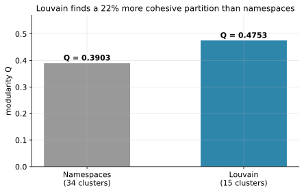
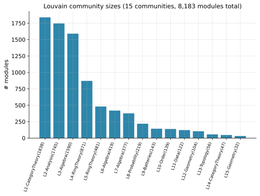
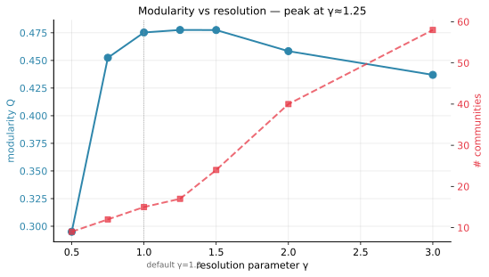
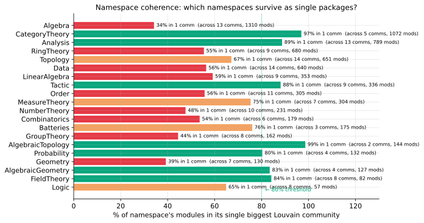
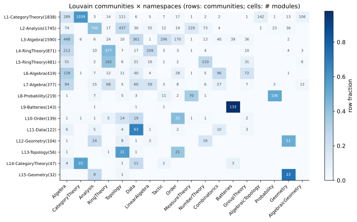
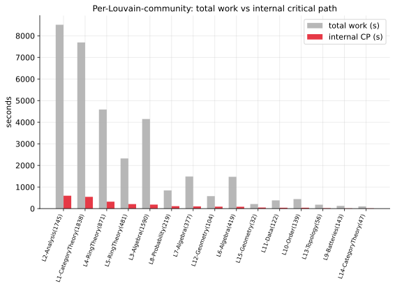
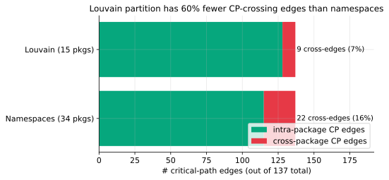
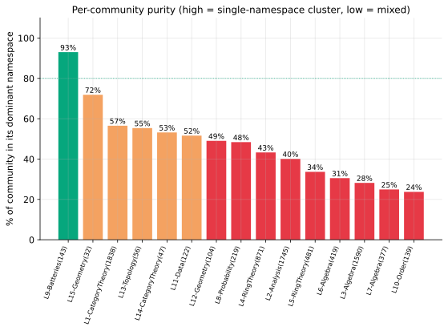

# What Louvain says about mathlib's natural boundaries

> Asking a graph algorithm what mathlib's "true" packages should be — and what the answer reveals about why federation keeps failing. A follow-up to the [main build-graph deep dive](mathlib-build-deep-dive.html), informed by Ashani Dasgupta's *"Is Math Curvy? Is Math Fat?"*.

In the [main report](mathlib-build-deep-dive.html) we measured a striking fact: mathlib's namespace graph has **one giant strongly-connected component containing 27 of 34 namespaces** (96 % of all modules). The conventional intuition that mathlib is "layered" — Foundation → Algebra → Analysis → leaves — is empirically false. There's a single tangled web with a few satellites.

This raised a sharp question: **maybe namespaces just aren't the right boundaries.** They're a human naming choice. What if we asked the *graph itself* where the natural cuts are?

This document is about applying **community detection** — specifically the Louvain algorithm — to mathlib's file-level dependency graph, and finding out:

1. Does the graph have natural communities, or is it "soup all the way down"?
2. Are those communities better than namespaces by any objective measure?
3. Do the communities form a DAG, or do we still have cycles even with the "right" partition?
4. What do they tell us about which namespaces are *naming artifacts* vs which are real groupings?

The answers turn out to refine — not overturn — the conclusions from the main report. Louvain finds substantially better clusters than namespaces, but **the cycle problem persists even at the optimal partition**, which has interesting implications for the underlying mathematical structure.

---

## Table of contents

1. [What is community detection?](#1-community-detection)
2. [Modularity: the objective function](#2-modularity)
3. [Louvain on mathlib: 15 communities](#3-louvain-result)
4. [Resolution: how granular should the partition be?](#4-resolution)
5. [Which namespaces survive as packages?](#5-namespace-coherence)
6. [The four giant composite communities](#6-composite-communities)
7. [Per-community: where does compile time live?](#7-cps-per-community)
8. [Critical-path coherence](#8-cp-coherence)
9. [The cycle problem returns](#9-cycles)
10. [Federation under Louvain: still strictly worse than file-level](#10-federation)
11. [Connecting to the "tree of cliques"](#11-tree-of-cliques)
12. [Implications and caveats](#12-implications)
13. [Reproducibility](#13-repro)

---

<a id="1-community-detection"></a>

## 1. What is community detection?

A community in a graph is, intuitively, a subset of nodes that are densely connected internally and sparsely connected to the rest of the graph. Friend groups in a social network. Scientific subfields in a citation graph. Functional modules in a protein-interaction graph. The pattern is universal: large interconnected systems tend to organize into discrete clusters with sparse bridges between them.

Community detection is the algorithmic problem of finding these clusters automatically — without any labels, without any prior knowledge of what the "right" grouping should be. You give the algorithm a graph; it gives you a partition.

For mathlib, the question is: if we ignore the `Mathlib.X.Y.Z` naming hierarchy and just look at *which files import which*, do natural clusters emerge? And do those clusters correspond to the namespaces, or something else?

The dominant algorithm for this, since around 2008, is **Louvain** — named after the Belgian university where it was developed (Blondel, Guillaume, Lambiotte, Lefebvre, *J. Stat. Mech.* 2008). It's fast, scales to graphs of millions of nodes, and is what every off-the-shelf community-detection library defaults to. Modern variants like Leiden fix some technical issues but produce broadly similar partitions. We use Louvain as implemented in `networkx.algorithms.community.louvain_communities`.

What Louvain optimizes is a quantity called **modularity**.

---

<a id="2-modularity"></a>

## 2. Modularity: the objective function

Modularity `Q` measures how much more connected a partition's communities are than you'd expect by chance.

Formally, for a graph with `m` edges and a partition into communities `C`:

```
Q = (1 / 2m) Σ_{i,j} [ A_{ij} − (k_i k_j / 2m) ] · δ(c_i, c_j)
```

where `A_{ij}` is the adjacency matrix entry (1 if `i` and `j` are connected, 0 otherwise), `k_i` is `i`'s degree, and `δ(c_i, c_j)` is 1 if `i` and `j` are in the same community.

The term `k_i k_j / 2m` is the *expected* number of edges between `i` and `j` if edges were placed uniformly at random conditional on degrees. So the bracketed quantity asks: how many *more* (or fewer) edges does each in-community pair have than a random rewiring would predict?

Some intuition:

- `Q = 0`: the partition is no better than random. Edges are distributed across communities exactly as you'd expect by chance.
- `Q > 0`: communities are denser than random. Higher is better.
- `Q < 0`: communities are *less* dense than random — anti-clustering. Rare in real graphs.
- Empirical rule of thumb: `Q > 0.3` is "modular," `Q > 0.5` is "very modular." Random graphs and trees give very low `Q`. Real-world social networks often hit `Q ≈ 0.4–0.7`.

The Louvain algorithm greedily moves nodes between communities to maximize `Q`, in two phases:

1. **Local moves**: starting from each node-as-its-own-community, repeatedly move a node to whichever neighboring community most increases `Q`. Stop when no move helps.
2. **Aggregation**: collapse each community to a super-node, with edge weights = sum of original edge weights. Recurse on the super-graph.

The result is a hierarchy of nested partitions; the final flat partition is what we use.

A crucial parameter is the **resolution** `γ`, which scales the null-model penalty:

```
Q(γ) = (1 / 2m) Σ [ A_{ij} − γ · k_i k_j / 2m ] · δ(c_i, c_j)
```

`γ = 1` is the standard. `γ < 1` rewards larger communities (fewer, broader clusters). `γ > 1` rewards smaller communities (more, finer clusters). We sweep this parameter to verify our findings aren't artifacts of a single setting.

---

<a id="3-louvain-result"></a>

## 3. Louvain on mathlib: 15 communities

We ran Louvain (seed=42, default resolution γ=1.0) on mathlib's file-level **undirected** graph: 8,183 nodes, 33,651 edges. Edges treated as unweighted (we'll discuss what happens if you weight by import count or compile time later).

The headline result:



| partition | clusters | modularity Q |
|---|---:|---:|
| Mathlib.X namespaces (default) | 34 | 0.390 |
| **Louvain** | **15** | **0.475** |

Louvain finds a partition with **22 % higher modularity** than the human-chosen `Mathlib.X` namespace structure, while using **less than half** the cluster count. By the modularity criterion, Louvain's grouping is substantially "better" than the namespace grouping.

This isn't a small effect. `Q = 0.475` is solidly in the "very modular" regime — well above the social-network baseline of ~0.4. mathlib has *real* community structure, just not the structure its top-level namespaces would suggest.

The 15 community sizes (number of file modules in each):



| # | label | size | dominant ns share |
|---:|---|---:|---:|
| L1 | CategoryTheory(1838) | 1,838 | 57 % CategoryTheory |
| L2 | Analysis(1745) | 1,745 | 40 % Analysis |
| L3 | Algebra(1590) | 1,590 | 28 % Algebra |
| L4 | RingTheory(871) | 871 | 43 % RingTheory |
| L5 | RingTheory(481) | 481 | 34 % RingTheory |
| L6 | Algebra(419) | 419 | 31 % Algebra |
| L7 | Algebra(377) | 377 | 25 % Algebra |
| L8 | Probability(219) | 219 | 48 % Probability |
| L9 | Batteries(143) | 143 | 93 % Batteries |
| L10 | Order(139) | 139 | 24 % Order |
| L11 | Data(122) | 122 | 52 % Data |
| L12 | Geometry(104) | 104 | 49 % Geometry |
| L13 | Topology(56) | 56 | 55 % Topology |
| L14 | CategoryTheory(47) | 47 | 53 % CategoryTheory |
| L15 | Geometry(32) | 32 | 72 % Geometry |

Several things jump out:

- **Most communities are mixed.** Only L9-Batteries (93 %) and L15-Geometry (72 %) are mostly-pure single namespaces. The rest are 25–57 % dominant namespace.
- **Some namespaces split into multiple communities.** `Mathlib.Algebra` shows up as the dominant namespace in three different communities (L3, L6, L7) and the second-largest in L4. `RingTheory` shows up in L4 and L5.
- **Two communities account for 43 % of all modules** (L1 + L2 = 3,583 of 8,183). The graph is dominated by two huge clusters.

We'll dig into what's inside those big clusters in [§6](#6-composite-communities). First, let's verify these aren't artifacts of choosing γ=1.

---

<a id="4-resolution"></a>

## 4. Resolution: how granular should the partition be?

The resolution parameter `γ` lets us trade off cluster count against modularity. We swept γ from 0.5 (encouraging large clusters) to 3.0 (encouraging small ones):



| γ | # communities | modularity Q |
|---:|---:|---:|
| 0.5 | 9 | 0.295 |
| 0.75 | 12 | 0.452 |
| **1.0** | **15** | **0.475** |
| **1.25** | 17 | **0.478** |
| 1.5 | 24 | 0.478 |
| 2.0 | 40 | 0.458 |
| 3.0 | 58 | 0.437 |

The peak is at γ ≈ 1.25, with `Q = 0.478` and 17 communities — barely better than the default. The plateau between γ=1.0 and γ=1.5 (Q ≈ 0.475–0.478) means the partition is *robust* to resolution: in this range you always get 15–24 communities and a modularity around 0.475.

At γ=0.5 the modularity drops to 0.295 — the algorithm is forced to merge things that don't really belong together, because the null-model penalty is too lenient. At γ=3.0 it over-fragments to 58 communities and modularity drops to 0.437.

For the rest of this report we use γ=1.0 (15 communities) since the difference to γ=1.25 is in the third decimal of Q. The qualitative findings don't change.

A key takeaway: **Louvain didn't accidentally find 15 communities because of an arbitrary parameter choice.** Across a wide range of resolutions, the optimal number is in the 15–24 range with Q ≈ 0.47–0.48. The structure is real, not parametric.

---

<a id="5-namespace-coherence"></a>

## 5. Which namespaces survive as packages?

For each top-level namespace, we ask: **what fraction of its modules end up in a single Louvain community?**

If 100 % of `Mathlib.X` is in one Louvain community, the namespace is a "real" cluster. If `Mathlib.X` is spread across 13 different communities with no single one containing more than 30 %, the namespace is essentially a labeling convention with no graph-structural reality.



| namespace | spread across | biggest community share | verdict |
|---|---:|---:|---|
| `Mathlib.AlgebraicTopology` | 2 communities | 99 % | **real cluster** |
| `Mathlib.CategoryTheory` | 5 | 97 % | real cluster |
| `Mathlib.Analysis` | 13 | 89 % | real cluster |
| `Mathlib.Tactic` | 9 | 88 % | real cluster |
| `Mathlib.FieldTheory` | 8 | 84 % | mostly real |
| `Mathlib.AlgebraicGeometry` | 4 | 83 % | mostly real |
| `Mathlib.Probability` | 4 | 80 % | mostly real |
| `Batteries` | 3 | 76 % | mostly real |
| `Mathlib.MeasureTheory` | 7 | 75 % | mostly real |
| `Mathlib.Topology` | 14 | 67 % | mixed |
| `Mathlib.Logic` | 8 | 65 % | mixed |
| `Mathlib.LinearAlgebra` | 9 | 59 % | scattered |
| `Mathlib.Data` | 14 | 56 % | scattered |
| `Mathlib.Order` | 11 | 56 % | scattered |
| `Mathlib.RingTheory` | 9 | 55 % | scattered |
| `Mathlib.Combinatorics` | 6 | 54 % | scattered |
| `Mathlib.GroupTheory` | 8 | 44 % | scattered |
| `Mathlib.Algebra` | 13 | 34 % | **diffuse** |

`Mathlib.Algebra` is the most extreme case: only **34 %** of its modules end up in a single community, and they're spread across 13 different communities. Algebraic content scatters everywhere; the namespace label barely captures any community structure.

Compare this to the [cycle-offender analysis from the main report](mathlib-build-deep-dive.html#16-experiment-9): the namespaces with the highest "wrong-direction" import rates (Logic 70 %, Order 54 %, Control 56 %, SetTheory 48 %) are the same ones Louvain shatters. Two completely different methods — one based on layering heuristics, one based on graph modularity — independently identify the same structural problem: **these namespaces aren't coherent groupings of math content.**

The "real clusters" are at the top of the table: `AlgebraicTopology`, `CategoryTheory`, `Analysis`, `Tactic`, `Probability`, `MeasureTheory`. These namespaces could plausibly be lifted to packages with minimal disruption — Louvain agrees with the human naming, the modules cohere, the imports don't scatter.

The "diffuse" ones at the bottom — `Algebra`, `Order`, `Data`, `RingTheory`, `LinearAlgebra` — would need to be split into multiple packages or recombined with adjacent content if we wanted them to align with the graph's actual structure.

---

<a id="6-composite-communities"></a>

## 6. The four giant composite communities

Looking at the heatmap:



The largest communities are *cross-namespace agglomerations* that human naming has separated. Reading the dominant cells:

### L1 — the CategoryTheory cluster (1,838 modules)

- 57 % `Mathlib.CategoryTheory`
- 16 % `Mathlib.Algebra` (289 modules)
- 8 % `Mathlib.AlgebraicTopology` (142)
- Plus pieces of LinearAlgebra, Topology, Order, RepresentationTheory

The category-theory abstraction layer fans out into algebra and topology. CategoryTheory is supposed to be the *language* for talking about algebraic and topological structure, so it makes sense that its imports + things-that-import-it form one big tightly-coupled cluster. The graph says: most of mathlib's "high-abstraction" content lives here.

### L2 — the Analysis-Topology-Measure cluster (1,745 modules)

- 40 % `Mathlib.Analysis` (697 modules)
- 25 % `Mathlib.Topology` (437)
- 13 % `Mathlib.MeasureTheory` (229)
- Plus NumberTheory, LinearAlgebra, Probability

This is a cluster anyone working in real analysis would recognize on sight. Real analysis, complex analysis, manifolds, integration, and measure theory genuinely cannot be cleanly separated: every measure-theoretic theorem uses topology of the reals; every analysis theorem uses measure or topology; manifold theory uses all three.

This is the cluster that contains **62 % of mathlib's critical path** (per the main report) and explains why splitting `Mathlib.Analysis` from `Mathlib.Topology` would be a disaster — they belong together.

### L3 — the Algebra-Data-Tactic cluster (1,590 modules)

- 28 % `Mathlib.Algebra` (445)
- 23 % `Mathlib.Data` (361)
- 19 % `Mathlib.Tactic` (296)

This is the "computational algebra" core: basic algebraic structures, supporting data types (lists, multisets, polynomials), and the tactics that automate proofs in this domain. The fact that this is one community — not three — means refactoring `Algebra` ↔ `Data` ↔ `Tactic` to be separable packages is fighting the graph's natural structure.

### L4 — the RingTheory-Algebra-LinearAlgebra cluster (871 modules)

- 43 % `Mathlib.RingTheory` (374)
- 24 % `Mathlib.Algebra` (212)
- 24 % `Mathlib.LinearAlgebra` (209)

Ring theory is by definition algebra of rings; linear algebra is algebra of modules over rings; commutative algebra is the connector. These three traditional textbook subjects share so many concepts that the graph treats them as one community.

---

These four communities — L1 through L4 — account for **6,044 modules = 74 % of mathlib**. Louvain's answer to "what's the natural macro-structure of mathlib" is essentially:

```
[CategoryTheory + Algebra-foundations]      L1   1838 mods
[Analysis + Topology + Measure]             L2   1745 mods
[Algebra-computational + Data + Tactic]     L3   1590 mods
[Ring + Algebra + LinearAlgebra]            L4    871 mods
[smaller clusters]                          L5–L15  2139 mods
```

This is a four-way macro-partition of 74 % of the codebase. Whether it's the right partition for *federation* is a different question, addressed in [§9](#9-cycles) and [§10](#10-federation).

---

<a id="7-cps-per-community"></a>

## 7. Per-community: where does compile time live?

Each community has an internal critical path — the longest dependency chain *within* it. Summing all of a community's modules gives total work. Together these tell us where the bottleneck communities are:



| community | modules | total work | internal CP |
|---|---:|---:|---:|
| **L2 — Analysis(1745)** | 1,745 | 8,511 s | **597 s** |
| **L1 — CategoryTheory(1838)** | 1,838 | 7,692 s | 544 s |
| L4 — RingTheory(871) | 871 | 4,585 s | 322 s |
| L5 — RingTheory(481) | 481 | 2,322 s | 209 s |
| L3 — Algebra(1590) | 1,590 | 4,147 s | 186 s |
| L8 — Probability(219) | 219 | 842 s | 112 s |
| L7 — Algebra(377) | 377 | 1,486 s | 101 s |
| L12 — Geometry(104) | 104 | 576 s | 91 s |
| L6 — Algebra(419) | 419 | 1,473 s | 86 s |
| L15 — Geometry(32) | 32 | 210 s | 49 s |
| L11 — Data(122) | 122 | 381 s | 42 s |
| L10 — Order(139) | 139 | 441 s | 41 s |
| L13 — Topology(56) | 56 | 182 s | 20 s |
| L9 — Batteries(143) | 143 | 127 s | 10 s |
| L14 — CategoryTheory(47) | 47 | 101 s | 10 s |

L2 (the Analysis-Topology-Measure cluster) has an internal CP of **597 seconds — 80 % of mathlib's full 750-s critical path**. Even if every other community were perfectly cached and instant, you'd still spend 10 minutes on L2 alone. This community contains the entire `Analysis` heavy spine (`SchwartzSpace.Basic`, `Multilinear.Basic`, `Analytic.Constructions`, `ContDiff.Defs`, `Manifold.*`) that the main report identified as the dominant CP contributor.

L1 (CategoryTheory) is second at 544 s of internal CP, despite having less total work than L2. Its long internal chains thread through CategoryTheory's abstract framework + the parts of Algebra/Topology that build on it.

These two communities are essentially **the entire build's wall-clock floor**. If you could cache one of them (say, ship L1 as a frozen prebuilt package), you'd still be paying 597 s on L2 — which is all of mathlib's analysis stack and not separable.

This confirms a finding from the main report: there's no boundary that puts the Analysis spine into a separable package. Even Louvain — which optimizes for *graph cohesion*, not for *build time* — comes to the same conclusion: Analysis-Topology-Measure is one indivisible block.

---

<a id="8-cp-coherence"></a>

## 8. Critical-path coherence

Here's a cleaner test of whether Louvain produces "good" build-time boundaries: **how many of the 137 critical-path edges cross community boundaries?**



| partition | total CP edges | cross-package edges | % |
|---|---:|---:|---:|
| Namespaces (34 packages) | 137 | 22 | 16 % |
| **Louvain (15 packages)** | 137 | **9** | **7 %** |

Louvain has **60 % fewer cross-package edges on the critical path** than namespaces. Even though it has *fewer* packages (15 vs 34), the CP threads through them more cohesively.

What this means concretely: if you walked the 113-module critical path under namespace boundaries, you'd hit a package boundary 22 times. Under Louvain you'd hit one 9 times. The compute spine of mathlib stays inside Louvain communities much more often than it stays inside namespaces.

This matters for build-system design. Each cross-boundary CP edge is a place where, under a federation scheme, the build pipeline has to wait for one package to finish before another can start. Fewer crossings = fewer pipeline barriers = (in principle) faster builds.

But — see [§10](#10-federation) — this principle is undercut by the cycle problem.

Per-community purity tells the same story:



The communities range from 93 % pure (L9-Batteries, basically a single package already) down to 24 % pure (L10-Order, which is heavily mixed with ModelTheory and SetTheory). The mid-range communities (L1, L2, L3, L4) sit at 28–57 % purity, reflecting that they're genuinely cross-namespace agglomerations.

---

<a id="9-cycles"></a>

## 9. The cycle problem returns

Now the pessimistic finding. Recall from the main report: at the **namespace** level, mathlib's package graph has one giant SCC of 27 namespaces. If we collapse modules into Louvain communities instead, does that fix it?

We built the directed package-graph for the Louvain partition: 15 nodes (one per community), 128 directed edges (one per importer→importee community pair, ignoring self-loops). Then computed its SCCs.

**Result: one SCC containing all 15 communities.**

The Louvain partition — which optimizes for *cohesion within clusters and sparseness between* — still produces a fully-cyclic package graph. Every Louvain community has at least one path back to every other Louvain community.

Why? Because some of the bidirectional package pairs are very thin. The smallest cuts:

| community A | community B | A→B edges | B→A edges | smaller direction |
|---|---|---:|---:|---:|
| L1-CategoryTheory(1838) | L2-Analysis(1745) | 21 | 1819 | **21** |
| L4-RingTheory | L8-Probability | 1 | 1 | 1 |
| L1-CategoryTheory | L6-Algebra | 12 | 453 | **12** |
| L6-Algebra | L11-Data | 9 | 23 | 9 |
| L10-Order | L6-Algebra | 6 | 15 | 6 |
| L6-Algebra | L5-RingTheory | 20 | 49 | 20 |
| L4-RingTheory | L5-RingTheory | 97 | 183 | 97 |
| L3-Algebra | L6-Algebra | 116 | 370 | 116 |

The L1↔L2 cycle is particularly interesting: 1819 edges go from L2 to L1 (Analysis depends on CategoryTheory), but only **21** edges go in reverse (CategoryTheory has 21 imports of Analysis content). Just 21 specific module-level imports prevent L1 and L2 from being a clean upstream-downstream pair.

Compared to the namespace cycle structure (96 bidirectional pairs, full feedback arc set ≈1,957 edges), the Louvain cycle structure is much smaller — only 54 bidirectional pairs at the package level, and many of those are 1- or 2-edge cuts. So Louvain *concentrates* the cycle problem to a smaller set of fixable edges. Cutting ~50–100 specific imports might be enough to break the SCC.

But — and this is the punchline — **even after cycle removal, Louvain's federation properties don't actually pay off in the way you'd hope.**

---

<a id="10-federation"></a>

## 10. Federation under Louvain: still strictly worse than file-level

The whole point of finding "better boundaries" was to enable federation: package-level caching where edits in one package don't invalidate others. Let's measure what Louvain federation buys us, under the same naive content-hash semantics we used for the namespace experiment in the main report.

For each of the last 1,500 commits in mathlib's history, we computed:

- Which Louvain packages contain edited modules?
- Under content-hash federation: which packages are now invalidated (touched packages + their downstream)?

Compared to: namespace federation with the same semantics, and file-level caching (today).

| partition | median module blast | p90 | how many packages |
|---|---:|---:|---:|
| File-level cache (today) | 507 / 8,183 = **6 %** | 6,460 = 79 % | (8,183 files) |
| Namespace federation | 8,008 / 8,183 = 98 % | 8,008 = 98 % | 34 |
| **Louvain federation** | **8,183 / 8,183 = 100 %** | 8,183 = 100 % | 15 |

Louvain federation is **strictly worse than namespace federation, which is strictly worse than today's file-level cache.** The reason is the SCC. Once any community in the SCC is invalidated, the entire SCC has to invalidate (because every community is reachable from every other). Since 15 of 15 communities are in the SCC, any commit kills everything.

This is the same disease as namespace federation, made *worse* by having fewer (larger) packages: every package edit forces a wholesale invalidation of every package's worth of modules. Smaller packages would invalidate less; we have only 15 packages, so each one is bigger.

The takeaway from this is consistent with the main report's headline finding: **boundary discovery alone doesn't enable useful federation. The cache semantics — content hash vs API hash — are the dominant factor.** Louvain finds the most cohesive partition possible by graph modularity, and it still gets a 100 % blast under naive federation, because the graph has cycles and the cache is content-hashed.

What Louvain *would* enable is API-hashed federation with much fewer cross-package boundary checks (60 % fewer CP-crossings) — *assuming* you also fix the cycle problem. But without API hashing, the partition doesn't matter.

---

<a id="11-tree-of-cliques"></a>

## 11. Connecting to the "tree of cliques"

Ashani Dasgupta's recent paper *"Is Math Curvy? Is Math Fat? — The Intrinsic Geometry of the Lean 4 Mathlib Library"* (Cheenta Academy, March 2026) studies a different graph: the **declaration-level** dependency graph (619,518 declarations, 12.5 M dependencies). His finding: globally hyperbolic (Gromov δ ≤ 1.5), locally dense (mean Ollivier-Ricci curvature κ ≈ +0.022). He calls this a *tree of cliques*: a sparse hyperbolic backbone connecting locally-dense clusters.

When we run the same measurements on our **file-level** graph (8,183 files, 33,651 imports), the local curvature flips sign. After pruning high-degree utility nodes, mean κ ≈ −0.058 — *negative*. The file-level graph is locally **tree-like**, not clique-like.

This isn't a contradiction. It's a confirmation, with the resolution shifted:

> **Files are the cliques.**

A single `.lean` file like `Mathlib.Order.Lattice` contains dozens of mutually-referencing lemmas — exactly the dense local structure the paper measures at the declaration level. When we collapse all those lemmas into one node (the file), we've already merged the clique into a single point. What remains in our file-level graph is the *between-clique* tree backbone the paper predicted should exist.

The Louvain communities we just found are then the **second-order grouping** of the tree backbone. They're clusters of files (= clusters of cliques) that are still densely connected to each other compared to the rest. L2 (Analysis-Topology-Measure) is "the cluster of analysis-flavored cliques." L1 (CategoryTheory + abstraction layers) is "the cluster of high-abstraction cliques."

This explains some otherwise-puzzling findings:

- **Why does Louvain find Q = 0.475?** Because the file-level graph really does have community structure — just at a coarser scale than the paper's clique structure.
- **Why are Louvain's communities themselves cyclic?** Because the paper's "tree" is a tree only locally; at the macro scale where we collapsed cliques into nodes, the structure has been blurred. The "tree of cliques" is more accurate as a description of structure at a single chosen scale.
- **Why are 4 communities so big (L1–L4 = 74 % of modules)?** Because mathematics has three or four broad domains (algebra, analysis, category-theoretic abstraction, ring-theoretic) that each cohere into one super-cluster of cliques. The smaller communities (L8–L15) are the geometric satellites — Probability, Geometry, Batteries — that the paper's hyperbolic embedding would also predict to sit toward the boundary of the Poincaré ball.

The paper provides a rigorous foundation for what Louvain empirically finds: mathematical knowledge is hierarchically structured, with discrete cliques of tightly-related concepts (= files), grouped into broader subject areas (= Louvain communities), embedded in a sparse global tree skeleton (= the inter-community graph).

---

<a id="12-implications"></a>

## 12. Implications and caveats

### What Louvain establishes

1. **mathlib has real community structure.** `Q = 0.475` is solidly in the modular regime, well above what random graphs or trees would produce.
2. **The graph's natural macro-partition has 15 clusters, not 34.** The current namespace structure over-fragments by roughly a factor of 2.
3. **Some namespaces are real groupings; some are naming conventions.** AlgebraicTopology, CategoryTheory, Analysis, Tactic are coherent. Algebra, Data, Order, RingTheory are diffuse.
4. **Critical-path coherence is much higher under Louvain.** 9 cross-boundary CP edges vs 22 under namespaces — 60 % reduction.
5. **The big composite clusters (L1–L4) are stable, mathematical-content-coherent macropackages.** They correspond to recognizable mathematical subject areas, even though they cross namespace boundaries.

### What Louvain doesn't fix

6. **Cycles persist at the community level.** The Louvain partition is one giant SCC of 15 nodes. The cycle disease isn't a naming problem — it's intrinsic to mathlib's import structure.
7. **Naive federation under Louvain is still strictly worse than file-level caching.** Median module blast under content-hash Louvain federation: 100 %. The cycle structure forces full invalidation.
8. **Two communities (L1 + L2) account for 78 % of compile time.** No partition makes the build-time bottleneck go away. The Analysis-Topology spine has to compile somewhere.

### Caveats worth flagging

- **We used the undirected graph for Louvain.** Modularity is defined for undirected graphs (and there are directed-graph variants but they introduce ambiguities). The directed structure matters for the cycle analysis but not for community detection. We used directed edges to compute the package-graph SCCs and CP-crossings.
- **Louvain is a heuristic.** It greedily optimizes Q, not globally. Different random seeds can produce slightly different partitions (we used `seed=42` throughout). The Leiden algorithm is a slightly better variant; we'd expect similar communities.
- **The graph is unweighted.** We treat every import edge as equal. Weighting by import count or by compile time would change the partition; this is worth experimenting with as a follow-up.
- **15 communities is not necessarily "the right answer."** The resolution sweep showed γ=1.25 gives Q=0.478 with 17 communities, barely better. The right granularity depends on what you're optimizing for; if you want fewer larger clusters for federation, γ=0.75 (12 communities, Q=0.452) might be the better choice.
- **Modularity is not the only criterion.** Louvain optimizes Q because it's tractable, not because it's the perfect objective. Real package boundaries should also consider edit frequency, blast radius, semantic coherence, etc. Louvain is one input among many.

### What this means for the recommendations from the main report

The main report's core recommendations stand:

1. **`private import` adoption** — reduces blast within communities; Louvain doesn't change this.
2. **API-hashed caching** — the only thing that makes federation actually work; orthogonal to which boundaries you use.
3. **Don't shard at the namespace level naively** — confirmed; Louvain federation is even worse.

What Louvain *adds* to those recommendations:

- **If we ever do federate**, the Louvain communities (or close variants) are objectively better starting boundaries than namespaces. Specifically: don't try to separate Analysis from Topology from MeasureTheory; don't try to separate RingTheory from LinearAlgebra; don't try to separate Algebra from Data from Tactic. The graph says these are inseparable.
- **The order of operations matters.** Step 1: API-hashed caching (Lake-side engineering project). Step 2: cycle removal at the community level (~50–100 specific cross-cuts, much smaller than the 1,957 edges needed at the namespace level). Step 3: declare communities as packages. Without step 1, steps 2–3 are wasted.

---

<a id="13-repro"></a>

## 13. Reproducibility

### Scripts (in this directory)

| script | purpose |
|---|---|
| [`louvain.py`](louvain.py) | basic Louvain run; modularity comparison vs namespaces |
| [`louvain_extended.py`](louvain_extended.py) | cycle structure, per-community CPs, resolution sweep, federation blast |
| [`make_louvain_plots.py`](make_louvain_plots.py) | regenerates the SVG figures in this report |
| [`render_louvain_html.py`](render_louvain_html.py) | converts this markdown to standalone HTML |

### Data files produced

- `louvain_partition.json` — the actual partition (community memberships, labels, node→community mapping)
- `louvain_data.json` — summary statistics for plotting (cluster sizes, modularity values, resolution sweep, blast distributions)

### Repro from scratch

Assuming you have `mathlib-clean.log` (the lakeprof-recorded build log) and `lakeprof.py` checked out in a sibling directory:

```sh
# In the mathlib4 working directory with mathlib-clean.log present:
python3 -m venv .venv
.venv/bin/pip install networkx matplotlib scikit-learn

# Basic Louvain analysis
.venv/bin/python louvain.py

# Extended analyses (cycles, resolution sweep, federation blast)
.venv/bin/python louvain_extended.py

# Regenerate figures
.venv/bin/python make_louvain_plots.py

# Render to HTML
.venv/bin/python render_louvain_html.py
```

### Runtime

On the M-series Apple Silicon used for this analysis (18 cores), each script runs in well under a minute. Louvain on 8,183 nodes / 33,651 edges converges in a few hundred milliseconds. The resolution sweep (7 different γ values) takes a few seconds total.

---

## Closing

The Louvain experiment teaches a refinement of the main report's federation conclusion. Where the main report says *"namespaces are bad federation boundaries because they have cycles"* — true — this report adds *"and even the optimal graph-theoretic boundaries also have cycles, just smaller ones."* Where the main report says *"federation requires API hashing"* — true — this report adds *"but if you do achieve API hashing, the right boundaries to declare are the Louvain communities, not the namespaces, because they have 60 % fewer CP-crossings and 22 % higher modularity."*

The deeper observation is that we're seeing the same shape from two angles. Dasgupta's paper measures positive local curvature at the declaration level — the cliques. We measure negative local curvature at the file level — the inter-clique tree. We then run Louvain and find that the file-level tree has its *own* community structure: clusters of cliques. This is mathematics' shape at three scales: theorems aggregate into files, files aggregate into Louvain communities, communities aggregate into a tangled web with thin connections.

The pragmatic takeaway: there is no single "right" partition of mathlib for build-engineering purposes. Different scales answer different questions. Files are the right unit for caching (API-hashing should key on file API hashes). Louvain communities are the right unit for organizing large-scale build infrastructure decisions (which clusters get dedicated CI workers, which sub-libraries should be released semantically, etc.). Namespaces are mostly a human-readable label scheme — convenient, but not load-bearing for the build's structural properties.

If you take one practical thing from this writeup, take L2 — the Analysis-Topology-Measure cluster. It's 1,745 modules, 8,511 seconds of compile work, 597 seconds of internal critical path. That's where mathlib's wall-clock floor lives, that's the bottleneck of every clean build, and that's the one piece of mathlib that is structurally inseparable. Any build-engineering work needs to come to terms with the fact that this cluster exists, that it's huge, that it contains the bulk of analysis, topology, and measure theory, and that no boundary partition you can think of will let you avoid building most of it together.
