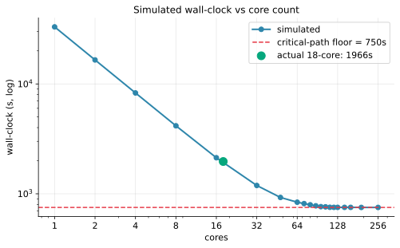
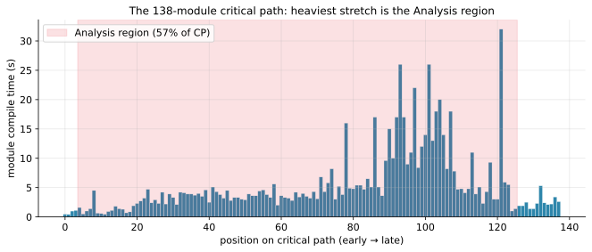
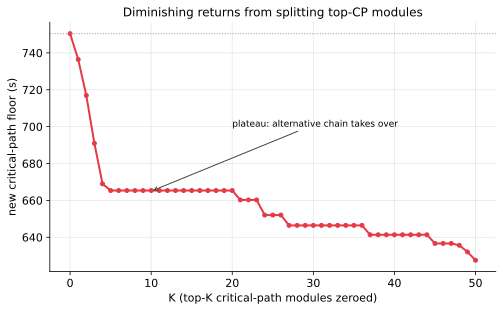
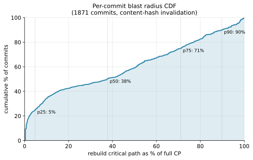
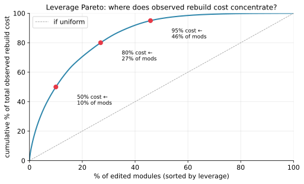
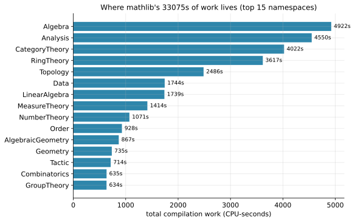
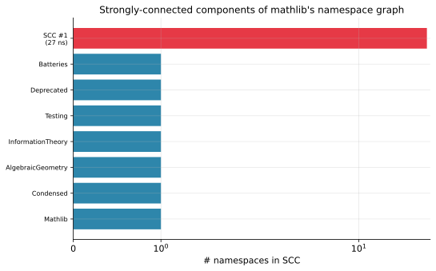
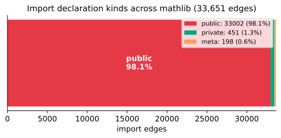
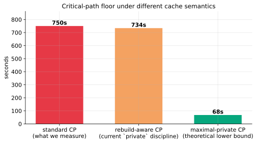

# Anatomy of a 9-hour build: what 8,393 Lean modules tell us about parallel build limits

> A deep dive into mathlib4's build graph — what sets the wall-clock floor, why throwing cores at it stops helping, where incremental rebuilds actually hurt, and why the "shard the codebase" intuition that everyone reaches for doesn't survive contact with the data.

We took mathlib4 — the largest formalization of mathematics in any proof assistant, ~8,200 Lean modules totaling 33,075 CPU-seconds (9 hours and 11 minutes) of single-threaded compile time — and asked it a series of pointed questions. *Where does your wall-clock floor come from? Why does adding cores stop helping past 32? What would it cost to shard you across 1,000 machines? Could `lake exe cache get` do better?* This document is the long-form report on what the answers turned out to be.

The work started simple — record one clean build, look at the critical path — and ended somewhere unexpected: with hard evidence that **mathlib has no layered architecture**, that **96 % of its modules participate in one giant cycle**, and that **the single largest available improvement is a one-line edit pattern that almost nobody is using**.

If you're a Lean engineer, a build-systems person, or someone who's ever wondered why "just parallelize it more" stops working, this might be useful. We tried to write it so that someone with no Lean background can follow along; concepts are introduced before they're used.

---

## Table of contents

1. [Setup: the tool, the data, the mental model](#1-setup)
2. [Concept: critical path and average parallelism](#2-concept-critical-path)
3. [Experiment 1: how parallel can a clean build actually go?](#3-experiment-1)
4. [Concept: the parallelism profile](#4-concept-parallelism-profile)
5. [Experiment 2: where is mathlib structurally narrow?](#5-experiment-2)
6. [Experiment 3: bottleneck what-ifs](#6-experiment-3)
7. [Concept: incremental builds and cache invalidation](#7-concept-incremental)
8. [Experiment 4: per-commit blast radius distribution](#8-experiment-4)
9. [Concept: leverage = edit frequency × blast](#9-concept-leverage)
10. [Experiment 5: where the rebuild seconds actually go](#10-experiment-5)
11. [Concept: federation, packages, and API hashing](#11-concept-federation)
12. [Experiment 6: naive federation is *strictly worse*](#12-experiment-6)
13. [Experiment 7: phasing the build always loses](#13-experiment-7)
14. [Concept: strongly connected components](#14-concept-sccs)
15. [Experiment 8: mathlib has one giant SCC](#15-experiment-8)
16. [Experiment 9: surgical cycle removal doesn't work](#16-experiment-9)
17. [Concept: `private import` and the module system](#17-concept-private-import)
18. [Experiment 10: the 91 % theoretical headroom](#18-experiment-10)
19. [Synthesis: what actually moves the floor](#19-synthesis)
20. [Recommendations](#20-recommendations)
21. [Related work: Li, Peng, Severini, Shafto (2026)](#21-related-work)
22. [Appendix: scripts and reproducibility](#22-appendix)

---

<a id="1-setup"></a>

## 1. Setup: the tool, the data, the mental model

### What is mathlib?

mathlib4 is the community library of mathematics formalized in Lean 4 — at the time of this writing, ~8,200 modules covering everything from basic logic and set theory through algebra, topology, analysis, number theory, algebraic geometry, and onward. It's the largest body of computer-checked mathematics in existence, and it's growing fast: roughly 100 commits a week, mostly via PRs from a community of contributors.

It's also a fearsome build. A clean compile from source takes hours even on beefy hardware. Mathlib's contributors don't usually pay this cost — they use `lake exe cache get`, which fetches pre-compiled `.olean` files from a cloud cache for whatever the current `main` is. But when caching falls through (a CI rebuild on a fresh runner, a contributor whose local toolchain doesn't match the cache, a bisect that crosses a toolchain bump), you discover what mathlib is *actually* doing.

### The tool: lakeprof

[lakeprof](https://github.com/Kha/lakeprof) is a small Python tool that does two things:

1. **`lakeprof record lake build`** — wraps `lake build`, timestamps every line of its output, and saves the result to a log file. Lake itself prints `Built X (Ys)` lines as each module compiles. The wrapper just adds wall-clock timestamps.

2. **`lakeprof report`** — reads that log file, reconstructs the dependency DAG by calling `lake query --no-build --json +<module>:header` (which gives Lake's parsed import statements with `isExported`/`isMeta`/`importAll` flags), and runs analyses: critical path, simulated builds at various core counts, a Chrome-tracing-format trace, etc.

It's about 360 lines of Python. We used it as a starting point and wrote ~12 follow-up scripts to extend the analysis; everything is in [the working directory](.) and listed in the [appendix](#21-appendix).

### The data

We did one clean build of mathlib4 at commit `36a97460` on a 2025-vintage Apple Silicon machine (18 performance + efficiency cores, 64 GB RAM):

- **Wall-clock**: 32m46s (1,966 seconds)
- **Jobs**: 8,393
- **Log**: `mathlib-clean.log` — every `Built X (Ys)` line with a wall-clock prefix
- **Toolchain**: `leanprover/lean4:v4.30.0-rc2`

We didn't run `cache get` first. The point was to measure compile time, not download time. After this single build, every subsequent analysis runs in seconds against the recorded log — we don't recompile mathlib for any of the experiments below.

We also pulled the last 1,500–2,000 commits from git history to study churn. mathlib has been getting roughly 100 commits a week, so this is about 4–5 months of activity.

### The mental model

A build is a directed acyclic graph (DAG) of compile tasks. Each task (a module) takes some amount of CPU time to run, and it can't start until all its dependencies (the modules it imports) have finished. The build system schedules these tasks across whatever CPUs are available.

There are two fundamental quantities:

- **Total work** = the sum of every task's compile time. This is what a single CPU would take.
- **Critical path** = the longest dependency chain in the DAG, weighted by task times. This is the *minimum possible wall-clock* under any number of CPUs, because the chain must run sequentially even if everything else is infinitely parallel.

Their ratio — `total_work / critical_path` — is the **average parallelism** of the graph: the maximum theoretical speedup you can get from throwing more CPUs at it.

For mathlib's clean build:

- **Total work**: 33,075 s ≈ 9 h 11 m
- **Critical path**: 750 s ≈ 12 m 31 s
- **Average parallelism**: **44**

So mathlib's clean build is 44× parallel. Not bad — but it means even with 1,000 cores, you're not going below 12 m 31 s. The graph won't let you.

The graph is what we're going to spend the rest of this post understanding.

---

<a id="2-concept-critical-path"></a>

## 2. Concept: critical path and average parallelism

Let's nail down the critical-path concept, because it's the load-bearing idea for the next several sections.

You have a DAG `G = (V, E)` where each node `v ∈ V` has a weight `t(v)` (compile time). The critical path is the longest path from any source (no incoming edges) to any sink (no outgoing edges), measured by the sum of node weights along the path. Let's call this length `C(G)`.

The total work is `W(G) = Σ_v t(v)`.

**Theorem** (Brent 1974, informal): the minimum wall-clock makespan `M*(G)` of any schedule that respects dependencies satisfies:

```
max(C(G), W(G)/p) ≤ M*(G) ≤ C(G) + W(G)/p
```

where `p` is the number of processors. The lower bound says you can never go faster than the critical path *or* faster than dividing total work evenly across all CPUs. The upper bound (Graham's bound) says greedy list scheduling gets within a factor of 2 of optimal.

For us this means:

- At `p = 1`: `M ≈ W = 33,075 s`
- At `p = ∞`: `M = C = 750 s`
- At `p = W/C = 44`: in theory you could be near `C` if scheduling works out
- For very large `p` (`p ≫ 44`): no further improvement; you're paying for cores that sit idle

The "average parallelism" of 44 means that, *averaged over the whole build*, there are 44 tasks that could run simultaneously. But at any given moment, the actual instantaneous parallelism varies — we'll see in [§5](#5-experiment-2) that some moments are very wide and others are very narrow.

This is the entire reason we care about graph shape. If the graph is wide-and-shallow, hardware solves your problem. If it's deep-and-narrow, no amount of hardware does.

---

<a id="3-experiment-1"></a>

## 3. Experiment 1: how parallel can a clean build actually go?

`lakeprof report -s` runs a list-scheduling simulator: given the DAG (with each node's recorded compile time), it walks event-by-event through a hypothetical build with `p` CPUs, dispatching each ready task as soon as a CPU frees up. Tie-breaking uses the original recorded order.

We ran the simulator at `p = 1, 2, 4, 8, ..., 256`, then a finer linear sweep between 64 and 256 to find the exact saturation point.



The numbers:

| cores | sim time | speedup |
|---:|---:|---:|
| 1 | 33,075 s | 1× |
| 2 | 16,543 s | 2.0× |
| 4 | 8,281 s | 4.0× |
| 8 | 4,158 s | 8.0× |
| 16 | 2,128 s | 15.5× |
| 32 | 1,189 s | 27.8× |
| 48 | 926 s | 35.7× |
| 64 | 838 s | 39.5× |
| 80 | 793 s | 41.7× |
| 96 | 763 s | 43.4× |
| 112 | 753 s | 43.9× |
| 128 | 752 s | 44.0× |
| 192 | 751 s | 44.0× |
| 256 | 751 s | 44.0× |

The recorded 18-core build (1,966 s) is the green dot. Note where it sits on the simulator curve — almost exactly between 16 cores (2,128 s) and 32 cores (1,189 s), which is reassuring. The simulator isn't perfect (it uses recorded order as tiebreaker, which isn't necessarily optimal), but it's calibrated.

What we learn from the curve:

1. **Below ~16 cores, the curve is essentially linear.** Doubling cores ≈ halving time. mathlib has plenty of average parallelism — 44× — and you're nowhere near it.

2. **Between 16 and 64 cores, you hit the law of diminishing returns hard.** Going from 32 to 64 cores buys you ~30 % time reduction, not 50 %. The reason is that some of those new cores spend time idle waiting on chains.

3. **Past 96–112 cores, the curve is essentially flat.** From 96 to 192 cores you save 12 seconds out of 763. The "knee" of the curve is around 96–112; the true saturation point is about 192.

4. **The asymptote (751 s) equals the critical path (which we computed independently).** This is the sanity check — `M*(G) → C(G)` as `p → ∞`.

The takeaway: **mathlib is structurally a 32-core problem.** Past 32 cores you're paying for cores you don't fully use. Past 128 you're paying for cores that are completely idle most of the time.

(There's a corollary worth flagging: the doubling sweep that lakeprof's `-s` flag ships with — `1, 2, 4, 8, ...` — actually overestimates the saturation point. It stops at 256 because doubling from 128 to 256 doesn't help, but the linear sweep showed that the floor is hit at 192. If you want the precise saturation point, do a linear sweep around the doubling-sweep knee.)

---

<a id="4-concept-parallelism-profile"></a>

## 4. Concept: the parallelism profile

The 44× average parallelism is averaged over the whole build. It hides a lot. Some moments have wide parallelism (hundreds of independent leaf compiles), others have narrow parallelism (a handful of bottleneck modules on the critical path are still running, with everything else already done).

The **parallelism profile** is what you get when you look, at every moment in the optimal schedule, at how many tasks are concurrently active. Plot that count vs time and you get an empirical view of "when is the build wide vs narrow."

Mathematically: simulate at `p = ∞`, get each task's start and stop times, then sweep a horizontal line over time and count tasks whose start ≤ now < stop.

The reason this matters: the *narrow stretches* are where the critical path is exposed and adding cores can't help. If 50 % of your wall-clock has only 8 tasks running, even 1,000 cores can only help during the other 50 %.

---

<a id="5-experiment-2"></a>

## 5. Experiment 2: where is mathlib structurally narrow?

We computed the parallelism profile for mathlib's clean build under unbounded parallelism. Here's what it looks like:


The horizontal red line is at 32 concurrent jobs. Anywhere below that line, even 32 cores can't be fully utilized. Anywhere far above it, you'd benefit from more cores up to that height.

Bucketing by concurrency level:

| concurrent jobs | time spent | fraction of CP |
|:---:|---:|---:|
| 0–7 | 24 s | 3.2 % |
| 8–15 | 58 s | 7.7 % |
| 16–31 | 236 s | **31.4 %** |
| 32–47 | 156 s | 20.8 % |
| 48–63 | 106 s | 14.1 % |
| 64–95 | 126 s | 16.8 % |
| 96–127 | 42 s | 5.5 % |
| 128–191 | 4 s | 0.5 % |

**42 % of mathlib's wall-clock has fewer than 32 tasks running.** The "wide zone" (96+ concurrent) is only 6 % of wall-clock — that's where the leaves are getting compiled in droves.

The shape tells a familiar story to anyone who's profiled a parallel build: a compact, narrow opening (the foundation files, mostly serial because everything depends on a few core modules), a fat middle (the explosion as wider layers come online), and a long tapering tail (the integration and cap-stone modules that depend on everything else).

The middle of the chart — peaks of 200+ concurrent tasks — is impressive. If you had 200 cores during those minutes, all of them would be working. The problem is those minutes are a small fraction of the total. The narrow stretches at the start and end are where you spend most of your wall-clock, and those stretches don't care how many cores you have.

This is the *structural* explanation for why the speedup curve flattens. It's not that mathlib is poorly parallelizable in some abstract sense — it's that mathematics has natural "spines" of foundational definitions that everything builds on, and those spines have to compile in order.

---

<a id="6-experiment-3"></a>

## 6. Experiment 3: bottleneck what-ifs

If 42 % of the wall-clock is spent on the critical-path spine, the obvious question is: what *is* the critical path, and what would it take to shorten it?

`lakeprof report -p` prints the critical path explicitly. For mathlib it's a 113-module chain that threads through:

```
Init.Prelude → Init.Notation → Init.Core → Init.Data.* → Order.* → 
Topology.* → Topology.Algebra.* → Analysis.Normed.* → 
Analysis.Seminorm → Analysis.Operator.{Bilinear,Multilinear} → 
Analysis.Analytic.* → Calculus.ContDiff.* → Geometry.Manifold.* → 
Analysis.Distribution.SchwartzSpace.* → Fourier.PoissonSummation → 
NumberTheory.LSeries.* → ModularForms.Discriminant → Mathlib
```

Most of those nodes are tiny (1–3 seconds each). But a handful are heavy:



The heaviest CP modules:

| s on CP | module |
|---:|---|
| 32.0 | `Mathlib.Analysis.Distribution.SchwartzSpace.Basic` |
| 26.0 | `Mathlib.Analysis.Normed.Module.Multilinear.Basic` |
| 26.0 | `Mathlib.Analysis.Analytic.Constructions` |
| 22.0 | `Mathlib.Analysis.Analytic.Basic` |
| 20.0 | `Mathlib.Analysis.Calculus.ContDiff.Defs` |
| 18.0 | `Mathlib.Analysis.Calculus.FDeriv.Analytic` |
| 18.0 | `Mathlib.Analysis.Calculus.ContDiff.Operations` |
| 17.0 | `Mathlib.Analysis.Seminorm` |
| 17.0 | `Mathlib.Analysis.Normed.Operator.Bilinear` |
| 17.0 | `Mathlib.Analysis.Normed.Module.Multilinear.Curry` |

That highlighted region in the chart is the Analysis hump. **62 % of the critical path lives inside `Mathlib.Analysis`** — eight of the top ten heaviest CP modules are Analysis modules.

So: what if we could split these into smaller pieces? Each module on the CP that takes 30 seconds to compile is, by definition, 30 seconds of unavoidable wall-clock. If we could split it into three 10-second pieces with the right dependency structure, parts of it could run in parallel and the path through it would shrink.

The cheap version of this experiment: zero out the time of the top-K CP modules entirely, and see what the new critical path is. This is a "what if these modules compiled in zero time" thought experiment — an upper bound on the gains from splitting them.



| K | new floor | gain |
|---:|---:|---:|
| 0 | 750 s | — |
| 1 | 736 s | 14 s |
| 3 | 691 s | 60 s |
| 5 | 665 s | 86 s |
| **10** | **665 s** | **0 (plateau)** |
| 25 | 652 s | <1 s/module |
| 50 | 628 s | <1 s/module |

The first five removals buy you 86 seconds. The next five buy you nothing. The plateau is dramatic.

The reason: when you remove enough modules from the original critical path, an *alternative* chain — one that shared most of its early portion with the original CP but branched off — becomes the new critical path. Now you're attacking a different chain. Removing more from the *original* CP doesn't help because that's no longer where the bottleneck is.

So splitting the top 5 Analysis modules is roughly **the entire achievable win from the "split heaviest CP modules" strategy**. It's about 11 % of the floor. Worth doing. Past that, you'd need to coordinate splits across multiple parallel chains, and the effort-to-reward ratio collapses.

---

<a id="7-concept-incremental"></a>

## 7. Concept: incremental builds and cache invalidation

So far we've talked about *clean* builds — start from nothing, compile everything. But that's not what real life looks like. Mathlib contributors don't recompile from scratch when they make a small edit; they rely on incremental builds.

An incremental build is what happens when you change some files and rebuild. Most of the existing build artifacts (the `.olean` files Lake produces) are still valid — only the changed files and their downstream dependents need to recompile. Whether a downstream artifact is still valid depends on the build system's *cache key*.

Lake's cache key today is roughly:

```
hash(source_file_bytes ⊕ deps' olean_hashes ⊕ toolchain_version)
```

This is **content hashing**. If any byte of the source file changes, the hash changes, the olean is invalidated, and every transitive dependent (every module that imports it, transitively) also invalidates because its `deps' olean_hashes` portion of the key changed.

This is *conservative*: it never falsely says a stale artifact is fresh. But it's also *spuriously aggressive*: if you change a comment, fix a typo in a proof body, or refactor a private helper, the file's bytes change → its olean's hash changes → every downstream module thinks its dependency changed and invalidates. The actual mathematical content visible to downstream consumers may be identical, but the cache doesn't know that.

This is the central tension. Content hashing is easy and safe. It's also wasteful, especially when changes are localized to *internals* that don't affect what downstream code observes.

The **blast radius** of a commit is the set of modules whose cache becomes invalid because of it. Under content hashing:

```
blast(commit) = changed_modules ∪ transitive_dependents(changed_modules)
```

If a commit changes a module deep in the dependency graph, its blast radius can be large. If it changes only leaf files, its blast radius is just those files plus a few umbrella modules at the top.

For each commit we ask: how many modules need to recompile, and what's the critical path through that set?

---

<a id="8-experiment-4"></a>

## 8. Experiment 4: per-commit blast radius distribution

We took the last 1,871 commits from mathlib's git history (using `git log --name-only`), mapped each touched `.lean` file to its module name, and computed the blast radius of each commit.

The metric we care most about is the **rebuild critical path** — the critical path through the subgraph induced on `{changed} ∪ transitive_dependents(changed)`. This is the minimum wall-clock you'd pay to rebuild after that commit, assuming infinite cores. Comparing to the full clean-build CP gives a percentage.



| quantile | edited mods | invalidated | rebuild work | rebuild CP | % of full CP |
|---|---:|---:|---:|---:|---:|
| p25 | 1 | 14 | 69 s | 34 s | **4.6 %** |
| **p50** | 2 | 507 | 2,778 s | 269 s | **35.9 %** |
| p75 | 4 | 2,604 | 13,436 s | 520 s | 69.3 % |
| p90 | 7 | 6,460 | 29,020 s | 667 s | 88.9 % |
| p95 | 13 | 7,363 | 31,832 s | 725 s | 96.7 % |
| p99 | 133 | 7,972 | 32,891 s | 746 s | 99.5 % |
| max | 1,100 | 8,008 | 32,922 s | 750 s | 100 % |

Reading this:

- **A quarter of commits are leaf-level.** They edit one file, invalidate ~14 modules, and have a rebuild CP of 34 seconds (≈90 seconds of actual wall-clock at 18 cores). This is the "fix typo in proof of an obscure lemma" kind of commit.

- **The median commit kills 36 % of the critical path.** Two modules edited, 507 invalidated, ~12 minutes of CP-bottlenecked work.

- **A quarter of commits invalidate >69 % of the critical path.** 

- **A tenth of commits invalidate ~89 % of the critical path** — basically a clean rebuild.

If mathlib had a "stable foundation, churning leaves" structure, the distribution would be very right-skewed: most commits at <5 % CP, with a long tail of foundation-touching commits. Instead, the median is at 36 % — meaning the typical mathlib commit hits something the rest of the codebase depends on.

### Where churn lands

We grouped commits by which top-level namespace they touched, and computed the average blast radius for files in each:

| namespace | commits (out of 1,871) | avg blast (% of graph) |
|---|---:|---:|
| `Mathlib.Algebra` | 366 (**19 %**) | **52 %** |
| `Mathlib.Analysis` | 308 (16 %) | 6 % |
| `Mathlib.Topology` | 264 (14 %) | 19 % |
| `Mathlib.RingTheory` | 256 (14 %) | 18 % |
| `Mathlib.Data` | 227 (12 %) | 45 % |
| `Mathlib.CategoryTheory` | 223 (12 %) | 11 % |
| **`Mathlib.Order`** | 200 (11 %) | **66 %** |
| `Mathlib.NumberTheory` | 173 (9 %) | 1 % |
| `Mathlib.LinearAlgebra` | 170 (9 %) | 23 % |
| **`Mathlib.Tactic`** | 162 (9 %) | **58 %** |

The **most-edited namespaces are the highest-blast ones**. `Mathlib.Algebra` is in 19 % of all commits and each touch invalidates ~half the graph. `Mathlib.Order` averages 66 % of the graph rebuilt per commit. `Mathlib.Tactic` averages 58 %.

The "leaves" exist — `NumberTheory` (1 % blast), `AlgebraicGeometry` (0.5 %), `Probability` (0.6 %), `AlgebraicTopology` (0.5 %) — but they only collectively account for ~15 % of edits. Most contributor activity lands in the high-blast foundation.

This is the empirical finding that everyone working on mathlib's build infrastructure should internalize: **the foundation is where the churn is**. If your mental model is "the math people work on the leaves while the foundation stays stable," reverse it.

---

<a id="9-concept-leverage"></a>

## 9. Concept: leverage = edit frequency × blast

Some modules are edited often but have small blast (cheap commits). Others are edited rarely but have huge blast (rare-but-painful). Some are *both* — edited often *and* expensive when they are. Those are the ones worth attacking.

The **leverage** of a module is `edit_count × blast_CP_seconds`. It's a single number that captures "how many wall-clock seconds did this module cost over the observation window" — a kind of regret metric. Sorting by leverage tells you where intervention pays off most.

Three regimes to keep in mind:

- **Hot + huge blast** (high edits, large CP through dependents) — the "bad" module. Common in foundation files. Lever: API stability / `private import` / API hashing (anything that decouples the file's content hash from its observable interface).
- **Cold + huge blast** (rare edits, large CP) — slow leaf-y modules deep on the CP. Lever: split / refactor for parallelism.
- **Hot + small blast** — leaf files. Lever: nothing, ignore.

If your top-N leverage list is dominated by Hot+Huge modules, you have an *interface stability* problem. If it's dominated by Cold+Huge, you have a *graph shape* problem. The two require very different fixes.

---

<a id="10-experiment-5"></a>

## 10. Experiment 5: where the rebuild seconds actually go

We computed leverage for every module that was edited at least once in the last 1,871 commits.



The Pareto curve is *not* sharply concentrated:

- Top 528 modules (10 % of edited modules) = 50 % of total observed cost
- Top 1,423 (27 %) = 80 %
- Top 2,421 (46 %) = 95 %

Compare to a 90/10 distribution (the dashed line) and you see the curve is much closer to uniform than typical Pareto behavior. mathlib's rebuild cost is *diffuse*.

But here's the key thing — it's diffuse, but the *type of fix* is uniform. Top 30 by leverage:

| rank | edits | blast CP | module |
|---:|---:|---:|---|
| 1 | 32 | 384 s | `Mathlib.SetTheory.Cardinal.Cofinality` |
| 2 | 16 | 739 s | `Mathlib.Tactic.Translate.Core` |
| 3 | 28 | 410 s | `Mathlib.SetTheory.Ordinal.Basic` |
| 4 | 21 | 405 s | `Mathlib.SetTheory.Ordinal.Arithmetic` |
| 5 | 10 | 738 s | `Mathlib.Tactic.Translate.ToDual` |
| 6 | 10 | 735 s | `Mathlib.Logic.Basic` |
| 7 | 9 | 714 s | `Mathlib.Order.Lattice` |
| 8 | 9 | 698 s | `Mathlib.Data.List.Basic` |
| 9 | 10 | 614 s | `Mathlib.Order.Cover` |
| 10 | 15 | 401 s | `Mathlib.SetTheory.Ordinal.Family` |
| 11 | 9 | 617 s | `Mathlib.Topology.Order` |
| 12 | 9 | 609 s | `Mathlib.Algebra.Group.Subgroup.Defs` |
| 13 | 10 | 540 s | `Mathlib.Data.NNReal.Defs` |
| 14 | 8 | 667 s | `Mathlib.Order.CompleteLattice.Basic` |
| 15 | 8 | 659 s | `Mathlib.Order.CompleteBooleanAlgebra` |
| 16 | 7 | 750 s | `Mathlib.Tactic.Linter.DirectoryDependency` |
| 17 | 7 | 733 s | `Mathlib.Tactic.Simps.Basic` |
| 18 | 8 | 636 s | `Mathlib.Order.ConditionallyCompleteLattice.Basic` |
| 19 | 7 | 725 s | `Mathlib.Order.OrderDual` |
| 20 | 9 | 558 s | `Mathlib.Algebra.Ring.Subring.Basic` |
| ... | ... | ... | ... |

Every single one of the top 30 modules is in the **Hot + Huge blast** regime. There is not a single Cold + Huge entry — no "rare-but-heavy" leaf to split. The fix type is uniform across the entire top end.

The story this tells is unambiguous: mathlib's incremental-build pain is overwhelmingly an *interface stability* problem. Every one of these modules sits early in the dependency graph and has hundreds of transitive importers, and they get edited often enough that those transitive importers eat the blast repeatedly.

The aggregate per-namespace breakdown matches:



Five foundation namespaces (Algebra, Data, Topology, Order, CategoryTheory) account for 60 % of all observed rebuild cost across the window we measured.

So far we have a clear picture of the problem: clean builds are CP-bound at 750 s, mostly in Analysis; incremental builds are *blast-bound* at ~36 % of CP per commit, mostly because of foundation churn under content-hash caching.

The natural next thought is: **let's restructure the codebase so commits don't blast so far.** Federation, sharding, splitting into independently-versioned packages. The next few sections walk through everything we tried and what stopped working.

---

<a id="11-concept-federation"></a>

## 11. Concept: federation, packages, and API hashing

"Federation" in this context means: split the codebase into independent packages with stable boundaries, so that when you edit something in package A, packages B, C, D... that depend on A don't necessarily have to rebuild — they just need to know that A's *public interface* is unchanged.

This is what monorepos at scale do: Bazel/Buck rules at Google/Meta key downstream cache validity on upstream's interface (ABI), not source bytes. Cargo workspaces, npm packages, OCaml `.cmi`/`.cmx` separation, Rust's incremental compilation fingerprints, Java ABI jars — all variations of the same idea.

There are two pieces to make this work:

1. **A boundary partition**: a function from modules to packages.
2. **A cache semantics**: when does an edit in package A invalidate package B's cache?

There are two flavors of cache semantics:

**Content-hash federation**: package B's cache key includes A's *content hash* (some hash of all source bytes in A). Any change to any file in A invalidates B. This is the dumb version — it doesn't gain you anything that file-level content hashing didn't already give you.

**API-hash federation**: package B's cache key includes A's *API hash* — a hash of A's externally observable interface (declaration signatures, instance declarations, exported macros, etc.), but NOT proof bodies, comments, or `private` internals. An edit that doesn't change A's API has no effect on B. This is the smart version, and it's the one that makes federation worthwhile.

For Lean 4 specifically, "the API" of a module would include:

- For each `theorem` / `lemma`: name + universe params + type signature + attributes
- For each `def`: name + type, and the body if `@[reducible]` (otherwise opaque)
- For each `instance`: name + type + priority
- For each `class` / `structure`: name + fields + parent classes
- For each `notation` / `syntax` / `macro`: full declaration (these expand at compile time and are part of the API)

Notably *not* part of the API: proof bodies (the actual `by` blocks), comments, whitespace, lemma ordering, `private` declarations.

If 80 % of mathlib commits change only proof bodies / internals (a plausible guess we haven't directly measured), then API-hashed federation would mean 80 % of commits don't invalidate downstream packages at all.

That's the thesis. The next several experiments stress-test it.

---

<a id="12-experiment-6"></a>

## 12. Experiment 6: naive federation is *strictly worse*

The first experiment is the brute-force one: what happens if we federate at namespace boundaries (each top-level `Mathlib.X` namespace = one package) but use *content-hash* cache semantics (the dumb version)?

A commit in package A invalidates A wholesale — not just the edited file, but every module in A — because the package is treated as one cache unit. Then it invalidates everything in packages B that transitively depend on A.

We computed the median module-level blast radius under this scheme, vs the file-level (current) cache, for the same 1,500 commits we measured earlier:

| approach | median module blast | p90 |
|---|---:|---:|
| File-level cache (today) | 507 / 8,183 = **6 %** | 6,460 = 79 % |
| Namespace federation (content-hash) | **8,008 / 8,183 = 98 %** | 8,008 = 98 % |

**Naive federation is strictly worse.** The granularity got coarser without getting smarter. Median commit invalidates 98 % of the graph instead of 6 %.

The intuition: under file-level caching, a commit that edits one file in `Mathlib.Algebra` only invalidates that file plus its specific transitive dependents. Under namespace federation with content hashing, that same commit invalidates *all* of `Mathlib.Algebra` (because the package's cache unit is the whole namespace), which then transitively invalidates all of `Mathlib.RingTheory`, `Mathlib.LinearAlgebra`, `Mathlib.Topology`, `Mathlib.Analysis`, ... — effectively everything downstream of Algebra, which is essentially everything.

This experiment is what crystallized the "federation requires API hashing" conclusion. There's no path to a useful boundary partition that doesn't go through API hashing as a prerequisite.

It also shows that **boundary location matters less than cache semantics**. Once API hashing exists, almost any reasonable boundary works (because most edits don't cross the API anyway). Without API hashing, no boundary helps.

---

<a id="13-experiment-7"></a>

## 13. Experiment 7: phasing the build always loses

A separate question: what if we don't change the cache semantics, but we organize the build into *phases*? Like, "first build foundations in parallel, then once that's done, build downstream in parallel."

This is a different kind of federation — not about what gets cached, but about scheduling discipline. The intuition is that you might be able to ship the foundation as a distributable artifact (one big tarball of oleans) and let downstream workers fetch it and build their leaves in parallel without needing the full graph.

We tested three "foundation cuts":

| cut | foundation includes | downstream is the rest |
|---|---|---|
| A | Init+Logic+Tactic+Util+Lean+Order+Data+Algebra+CategoryTheory+Topology+Combinatorics | everything else |
| B | A + LinearAlgebra+RingTheory+GroupTheory+FieldTheory+SetTheory | everything else |
| C | B + Analysis + MeasureTheory | everything else |

For each cut we compute (a) the foundation's internal critical path under unbounded parallelism, and (b) the downstream's critical path *given* the foundation is fully built (foundation modules have time = 0 for the downstream computation). Then we sum: pipelined wall-clock = `CP(foundation) + CP(downstream)`.

The idea is that this is what a "build foundation, then build downstream" pipeline would cost.

Compare to monolithic — where the build system is free to schedule downstream tasks the moment their *specific* foundation deps finish, without waiting for the whole foundation:

| strategy | wall-clock (∞ cores) | vs monolithic |
|---|---:|---:|
| **Monolithic** | 750 s | — |
| Cut A: foundation → downstream | 861 s | **+15 %** |
| Cut B: foundation → downstream | 1,010 s | +35 % |
| Cut C: foundation → downstream | 975 s | +30 % |

Phasing the build is **always slower than monolithic**. The reason: in a monolithic build, downstream modules can start as soon as their *specific* upstream deps are finished. In a phased build, every downstream module has to wait for *all* of the foundation. That's an artificial barrier, and the cost is `CP(foundation) - longest_path_to_first_downstream_start_in_monolithic`. It's always positive.

Phasing only helps if you have a reason to *physically* require the barrier — for example, you need to ship the foundation's olean tarball over a network before downstream workers can start, and the network transfer is non-trivial. For any setup that has shared local storage of intermediate artifacts (which CI generally does), phasing is pure overhead.

The combined result of [experiment 6](#12-experiment-6) and [experiment 7](#13-experiment-7) is that **two separate boundary-imposing schemes both underperform the monolithic baseline**. The monolithic build is good at exactly what it does — interleave fine-grained tasks across the entire DAG with no synthetic barriers. Imposing structure on top of it costs you something every time.

This is when we started suspecting that the problem wasn't about boundary location at all. It was something deeper.

---

<a id="14-concept-sccs"></a>

## 14. Concept: strongly connected components

A strongly connected component (SCC) of a directed graph is a maximal subset of nodes where every node can reach every other via directed edges. In a DAG, every SCC has size 1 (no cycles). In a graph with cycles, SCCs are bigger.

SCCs are computed by Tarjan's algorithm in linear time. The condensation of a graph (collapsing each SCC to a single super-node) is always a DAG.

The reason this is the right concept here: federation requires the **package-level graph** to be a DAG. If two packages mutually depend (A imports B and B imports A), then they're in the same SCC, and you can't separate them — you can only build them together as one unit.

For mathlib, the *module-level* graph is necessarily a DAG (Lake forbids circular module imports — `lake build` would refuse to compile). But the *namespace-level* graph — where you collapse all modules in `Mathlib.Algebra.*` into one node, all of `Mathlib.Topology.*` into another, etc. — might not be. If `Mathlib.Algebra.Foo` imports `Mathlib.Topology.Bar` and `Mathlib.Topology.Baz` imports `Mathlib.Algebra.Quux`, the namespace graph has both `Algebra → Topology` and `Topology → Algebra`, so they're in the same SCC. There's no module-level cycle, but there's a namespace-level cycle.

This is the setting in which we asked: how clean is mathlib's namespace-level graph?

---

<a id="15-experiment-8"></a>

## 15. Experiment 8: mathlib has one giant SCC

We built the namespace-level digraph (top-level `Mathlib.X` granularity, 34 nodes total) and computed its SCCs.



The result:

- **One SCC contains 27 namespaces** = 7,836 modules = **96 % of mathlib**
- 7 small SCCs each contain a single namespace: `AlgebraicGeometry`, `Condensed`, `InformationTheory`, `Testing`, `Deprecated`, `Mathlib` (umbrella), `Batteries` (external dep)

Inside the giant SCC, in alphabetical order: Algebra, AlgebraicTopology, Analysis, CategoryTheory, Combinatorics, Computability, Control, Data, Dynamics, FieldTheory, Geometry, GroupTheory, Init, Lean, LinearAlgebra, Logic, MeasureTheory, ModelTheory, NumberTheory, Order, Probability, RepresentationTheory, RingTheory, SetTheory, Tactic, Topology, Util.

This includes essentially everything — foundations *and* the supposed "leaves." `NumberTheory`, `Probability`, `AlgebraicTopology`, `MeasureTheory`, `Geometry` — they're all *inside* the cycle.

The conventional intuition is wrong. **mathlib has no layered architecture at the namespace level.**

To see this concretely, here are the top "wrong-direction" import edges (where importer is in a layer that should be upstream of importee, under the typical assumption that Algebra is more foundational than NumberTheory etc.):

| count | importer ns | importee ns |
|---:|---|---|
| 376 | Mathlib.Data | Mathlib.Algebra |
| 117 | Mathlib.Combinatorics | Mathlib.Algebra |
| 59 | Mathlib.Order | Mathlib.Algebra |
| 57 | Mathlib.Tactic | Mathlib.Algebra |
| 31 | Mathlib.RingTheory | Mathlib.Topology |
| 22 | Mathlib.Order | Mathlib.CategoryTheory |
| 14 | Mathlib.Analysis | Mathlib.Geometry |
| 14 | Mathlib.RingTheory | Mathlib.Analysis |
| 14 | Mathlib.SetTheory | Mathlib.Algebra |
| 14 | Mathlib.RingTheory | Mathlib.NumberTheory |

`Mathlib.Data` imports 376 things from `Mathlib.Algebra`. If `Data` were truly more foundational than `Algebra`, that wouldn't happen. The reality is that `Mathlib.Data` is a grab-bag including things like polynomials and matrices that genuinely depend on algebraic structures.

We verified this is structural, not naming-level: at 3-level granularity (`Mathlib.X.Y` — 1,378 packages), the largest SCC still contains 938 packages = 7,173 modules = 88 % of mathlib. At 4-level granularity (`Mathlib.X.Y.Z` ≈ directory level — 5,788 packages), the largest SCC drops to 2,812 packages = 4,677 modules = 57 %. **No reasonable namespace partition gives a DAG.** The cycles persist at every level of granularity.

What's left as actually-extractable (sitting outside the giant SCC, today, with no refactoring):

| namespace | modules | work | internal CP |
|---|---:|---:|---:|
| `Mathlib.AlgebraicGeometry` | 127 | 867 s | 218 s |
| `Mathlib.Condensed` | 34 | 161 s | 35 s |
| `Mathlib.InformationTheory` | 6 | 23 s | 8 s |

Plus some tiny test/deprecated stuff. **About 2 % of mathlib is naturally federable today.**

For the remaining 96 %, federation requires either:

1. A massive structural refactor (relocate every module that creates a cycle to a more appropriate namespace), or
2. Federation at a level of granularity where modules cohere into a DAG (per-file, which is just file-level caching), or
3. Abandoning the layered-package model and using the SCC condensation directly as the package partition (which gives you one giant package and a few tiny satellites — not useful)

---

<a id="16-experiment-9"></a>

## 16. Experiment 9: surgical cycle removal doesn't work

If the cycles are caused by a small set of misplaced files (one Algebra file that incorrectly imports a NumberTheory utility, a Logic file that imports something it shouldn't), maybe targeted refactoring could break enough of them to enable layered federation.

We computed, for each module, the number of "wrong-direction" outgoing imports under a proposed layering (foundations → algebra → analysis → leaves). 1,494 modules contributed at least one wrong-direction edge — so the offenders are *spread across* 18 % of all modules.

Worst individual offenders:

| wrong | edits | module | imports into |
|---:|---:|---|---|
| 27 | 4 | `Mathlib.Init` | Tactic, Lean, Util (umbrella) |
| 8 | 2 | `Mathlib.Tactic.Positivity.Basic` | Algebra, Data |
| 8 | 1 | `Mathlib.Logic.Godel.GodelBetaFunction` | Data, Order |
| 8 | 2 | `Mathlib.Order.RelSeries` | Data, Algebra |
| 7 | 2 | `Mathlib.Order.Filter.Pointwise` | Algebra, Data |
| 7 | 13 | `Mathlib.Algebra.Module.Torsion.Basic` | RingTheory, LinearAlgebra |

Some of these are *misnamed*. `Mathlib.Logic.Godel.GodelBetaFunction` lives in `Logic` but mostly imports from `Data` and `Order` — by content, it might belong in `Data.Godel` or even higher. `Mathlib.Tactic.Positivity.Basic` is in `Tactic` but uses Algebra concepts — it's an applied tactic, not a foundational one.

This raised a hypothesis: maybe relocating the worst offenders would shrink the giant SCC dramatically. We tested it:

| top-K modules removed | namespace edges remaining | biggest namespace SCC |
|---:|---:|---:|
| 0 | 397 | 27 |
| 5 | 393 | 26 |
| 10 | 393 | 26 |
| 25 | 391 | 26 |
| 50 | 389 | 26 |
| 100 | 389 | 26 |
| 200 | 386 | 26 |
| **500** | 378 | **26** |

Removing the worst 500 cycle-makers — about 6 % of mathlib's modules, each of which creates multiple back-edges — shrinks the SCC by **exactly one** namespace. The cycles are diffuse, not concentrated. There is no surgical fix.

The reason: cycles between two namespaces (say Data ↔ Algebra) are maintained by *many* module-level edges in both directions. Removing the few worst offenders leaves the cycle intact, because dozens of other Data→Algebra edges and Algebra→Data edges remain. The full feedback arc set — the minimum number of edges to remove to make the graph acyclic — is roughly **1,957 edges = 11 % of cross-namespace edges**. That's not a surgical fix; that's a deep structural rewrite.

The really damning observation: **`Mathlib.Logic` has 70 % of its modules contributing wrong-direction edges. `Mathlib.Order` has 54 %. `Mathlib.Control` has 56 %. `Mathlib.SetTheory` has 48 %.** These namespaces are not foundations — they're application layers wearing foundation names. The actually-low-cycle namespaces (`NumberTheory` at 0 %, `MeasureTheory` at 4 %, `Topology` at 10 %, `Analysis` at 10 %) sit *higher* in the stack.

So the conclusion of the federation thread is harsh:

1. Naive federation under content hashing is strictly worse than file-level caching.
2. Phased pipelines are slower than monolithic.
3. mathlib's namespace structure is a giant SCC, with no surgical fix and no level of granularity where cycles disappear.
4. Only 2 % of mathlib is naturally federable.
5. Making more of mathlib federable requires both (a) restructuring ~2,000 imports and (b) implementing API-hashed cache semantics in Lake.

That second prerequisite — API-hashed cache semantics — is the upstream-Lean engineering project that everything else hinges on. Without it, no boundary partition matters. With it, you might not even need to refactor much.

---

<a id="17-concept-private-import"></a>

## 17. Concept: `private import` and the module system

Lean 4 has a feature that's the closest existing approximation of API-hashed caching: `private import`.

There are three flavors of import in Lean 4:

```lean
import X            -- public import: X is part of my public interface
private import X    -- X is only used in my impl; downstream doesn't see it
meta import X       -- X only needed at macro expansion time
```

When module `B` does `import A`, then any module `C` that does `import B` also transitively sees A — the imports propagate. When `B` does `private import A`, that propagation stops. `C` won't have access to A's contents through `B`, even though `B` itself uses A internally.

This matters for *both* compile speed (Lean's elaborator has fewer transitive imports to walk) and rebuild semantics (Lean's *rebuild-aware critical path* takes private imports into account when computing what would invalidate what).

`lakeprof report -r` computes the rebuild-aware critical path. It walks the graph honoring `isExported`/`isMeta`/`importAll` flags from Lake, and produces a "what's the longest chain to rebuild this module under the module system's semantics" answer. It's a different number from the standard CP, and the gap between them is the value of mathlib's existing `private import` discipline.

For mathlib:

- Standard CP: 750.9 s
- Rebuild-aware CP: 737.9 s

The current `private import` discipline saves about 13 seconds, or 1.7 % of the floor. That's small. The question is: how much *headroom* is there?

---

<a id="18-experiment-10"></a>

## 18. Experiment 10: the 91 % theoretical headroom

To bound the value of `private import` adoption, we did the following thought experiment:

> Replace every `import` in mathlib with `private import` (set `isExported = False` on every edge). Re-run the rebuild-aware CP computation. What's the new floor?

This is an unrealistic upper bound — many imports must be public for Lean's instance resolution, syntax handling, `@[reducible]` defs, etc. But it gives a hard ceiling on what the mechanism could buy in the limit.

We also looked at what the *current* state of mathlib's imports is:



| import kind | count | percent |
|---|---:|---:|
| public (`isExported: true`) | 33,002 | **98.1 %** |
| private (`isExported: false`) | 451 | 1.3 % |
| meta | 198 | 0.6 % |
| importAll | 4 | 0.0 % |

**Only 1.3 % of mathlib's imports are private.** On the standard critical path itself, 132 of 137 edges (96 %) are public.

So mathlib has barely adopted `private import` at all. What does the headroom look like?



| metric | value |
|---|---:|
| standard CP (no module-system smarts) | 750 s |
| rebuild-aware CP (current discipline) | 734–738 s |
| **maximal-private rebuild CP** | **68 s** |

Under the (unreachable) assumption that every import becomes `private import`, the rebuild-aware critical path drops from 734 s to **68 s — a 91 % reduction**.

We don't think you can hit 68 s in practice. Many imports really must be public — anywhere a downstream module needs the *type* (not just the implementation) of an upstream construct, the upstream has to be a public import. Anywhere a downstream uses an instance from upstream, the instance has to be exported.

But you don't have to hit the lower bound to win. Capturing 10–20 % of the headroom translates to 60–130 s of CP. That's *more* than the entire payoff from splitting the top 5 Analysis modules (86 s), and it requires no graph restructuring — just changing `import X` to `private import X` in places where the import is used only in proof bodies, internal helpers, or `meta` code.

Mechanically discoverable conversion candidates: among the top 30 modules on the standard critical path, there are **329 incoming public imports from non-CP modules** that are conversion candidates (they could become `private import` without changing the standard CP, only shrinking the rebuild blast for non-CP edits).

The catch — and it's an important one — is that `private import` only buys you something at the rebuild-CP level. **Lake's actual cache today still uses content hashing.** Even with full `private import` adoption everywhere, an edit to a privately-imported file still changes that file's content hash, which changes its olean hash, which changes downstream cache keys. The Lean module system "knows" about the private boundary, but the cache doesn't.

To make `private import` actually pay off in cache-hit terms, Lake would need to start keying on signature hashes rather than content hashes. That's the Lake-side engineering project. `private import` adoption is the prep work that makes the eventual signature-hash cache effective.

---

<a id="19-synthesis"></a>

## 19. Synthesis: what actually moves the floor

Across every analytical lens — clean-build CP, simulation parallelism profile, churn distribution, leverage ranking, namespace cycles, partition simulation, cycle-offender enumeration, module-system delta — the conclusion converged from different angles:

**The wall-clock floor is set by graph shape; graph shape can't be fixed by sharding, hardware, or boundary location. Only two things move it: cache semantics that don't invalidate spuriously, and targeted refactor of the few hot Analysis modules at the floor.**

The full inventory of insights from this session, ordered roughly by surprise factor:

1. **96 bidirectional namespace pairs.** mathlib's namespace structure is pervasively cross-coupled, not layered.
2. **The "leaves" aren't leaves.** AlgebraicTopology, MeasureTheory, NumberTheory, etc. are inside the giant SCC. Only AlgebraicGeometry, Condensed, InformationTheory truly sit downstream.
3. **`Mathlib.Logic` is a misnomer.** 70 % of its modules import downstream namespaces. Same story for `Order` (54 %), `Control` (56 %), `SetTheory` (48 %).
4. **There is no surgical fix for the cycles.** Removing the top-500 wrong-direction importers shrinks the giant SCC by exactly 1 namespace.
5. **Cycles persist at every granularity.** 4-level (directory) partitioning still has 57 % of modules in one SCC.
6. **Federation without API-hashing is *strictly worse* than file-level caching** (98 % vs 6 % median module blast).
7. **Two-phase builds are 15–35 % slower than monolithic.** Phasing imposes synthetic barriers.
8. **The median commit invalidates 36 % of CP** under content hashing. Only 25 % of commits are leaf-level.
9. **Foundation namespaces are the most-edited.** `Mathlib.Algebra` is in 19 % of all commits. `Mathlib.Order` averages 66 % of graph rebuilt per commit.
10. **The top-30 leverage modules are uniformly Hot+HugeBlast.** Zero are split candidates. One mechanism (private-import / API hashing) addresses all of them.
11. **Only 1.3 % of mathlib's imports are private.** Maximal `private import` adoption could reduce rebuild CP by 91 % (theoretical). Even modest adoption is worth tens of seconds of CP.
12. **True saturation at 192 cores; practical knee at ~96–112.** 32 cores buys ~20 min wall-clock — the practical sweet spot.
13. **62 % of the parallelism floor lives in `Mathlib.Analysis` alone.** No amount of cores changes that.

---

<a id="20-recommendations"></a>

## 20. Recommendations

Ordered by leverage, with explicit cost/risk/payoff:

### Tier 1: do these now

**(A) Deploy a per-PR blast-radius predictor.** [`pr_impact.py`](pr_impact.py) is in the working directory and works end-to-end. Wire it as a GitHub Action that comments on every PR. Posts predicted modules invalidated, rebuild CP, and flags any top-50 hot-list module touches. Effort: a day. Value: makes cost visible; turns a hidden externality into a reviewer-relevant data point.

**(B) Start the `private import` audit.** Walk through the top 50 leverage modules; for each, check which of its imports are used only in proof bodies, internal helpers, or `meta` code. Convert those to `private import`. Each conversion is a localized PR. No coordination needed across files. Effort: ongoing background work; one engineer at 25 % time can churn through many in a quarter. Value: directly attacks the highest-leverage problem; the rebuild-aware CP improvement is measurable via `lakeprof report -r`.

**(C) Weekly clean-build CI job.** Currently mathlib's CI uses the cache. Add a weekly CI job that does a clean build with `lakeprof record`, uploads the log as an artifact. Build the longitudinal dataset that everything else (regression detection, hot-list tracking, namespace coupling drift) needs. Effort: half a day.

### Tier 2: do these this quarter

**(D) Targeted refactor of the top 5 Analysis CP modules.** Specifically:

- `Mathlib.Analysis.Distribution.SchwartzSpace.Basic` (32 s)
- `Mathlib.Analysis.Normed.Module.Multilinear.Basic` (26 s)
- `Mathlib.Analysis.Analytic.Constructions` (26 s)
- `Mathlib.Analysis.Analytic.Basic` (22 s)
- `Mathlib.Analysis.Calculus.ContDiff.Defs` (20 s)

Each split into smaller pieces with parallelizable structure. Bounded payoff (~85 s of CP, ~11 % of clean-build floor). Don't expand to K=10+; the data shows zero additional gain there until parallel chains are also addressed.

**(E) API-hash measurement instrumentation.** Build a syntactic API-diff tool: parse each `.lean` file, extract declaration headers (theorem types, def signatures, instance declarations, exported macros/notation), hash that. Run it across mathlib's commit history. Answer the empirical question: *what fraction of commits actually change the public API?* Without this number, the case for the upstream Lake engineering project is speculative; with it, it becomes data-driven. Effort: 1–2 weeks for a crude version, includes some Lean parsing.

### Tier 3: longer horizon, biggest payoff

**(F) Lake API-hashed caching.** Once (E) produces the empirical case, propose to upstream Lean/Lake that downstream cache keys depend on upstream's API hash, not content hash. This is the multiplier on (B) — `private import` adoption only realizes its full value once the cache is signature-aware. Effort: multi-month upstream engineering project; requires precise API-surface specification for Lean (signatures + reducibility + instance priorities + macros), determinism guarantees, and integration into Lake's existing trace mechanism.

### Things to not do

- **Don't try to phase the build.** Two-phase pipelines are 15–35 % slower than monolithic.
- **Don't shard at namespace level without API hashing.** Strictly worse than current.
- **Don't pursue per-namespace federation without first relocating ~1,957 specific imports** (the feedback arc set). The cycles will sabotage any package boundary.
- **Don't buy >128-core hardware** for clean-build throughput. The curve is essentially flat past 96–112 cores.
- **Don't expand the K=5 Analysis split** to K=10+. Returns plateau immediately.

---

<a id="21-related-work"></a>

## 21. Related work: Li, Peng, Severini, Shafto (2026)

After the analysis above was largely complete, a paper appeared on arXiv that's worth engaging directly: *The Network Structure of Mathlib* by Xinze Li, Nanyun Peng, Simone Severini, and Patrick Shafto ([arXiv:2604.24797v1](https://arxiv.org/abs/2604.24797), April 2026, with affiliations spanning Toronto, UCLA, UCL, Rutgers, and Google). They run a multi-layer network analysis on a slightly older mathlib snapshot (commit `534cf0b`, 2 February 2026) and answer questions in the same neighborhood as this writeup. This section compares findings, calls out where they go further than I did, and where my analysis adds something they don't have.

This is independent corroboration of the central claims, not a replication, and the two analyses are substantially complementary.

### What the paper measures

They construct three layered graphs:

- **Declaration graph** — 308,129 nodes, 8.4M edges. Every theorem, definition, and instance is a node; every premise referenced in a proof or definition body is an edge.
- **Module graph** — 7,563 nodes, 23,570 edges. Each `.lean` file is a node; each `import` is an edge.
- **Namespace graph** — 10,097 nodes, 332,081 edges. Multi-level dotted-name prefixes (`Mathlib.Topology.MetricSpace.*` and so on) define the partition.

They report DAG depth at each layer (153 / 84 / 8), modularity, NMI alignment to namespaces, centrality rankings, and a number of structural statistics about decomposed edge categories.

### Headline numbers, side by side

| Metric | Li et al. (Feb 2026) | This analysis (May 2026) |
|---|---:|---:|
| Modules | 7,563 | 8,183 |
| Module-level edges | 23,570 | 33,651 |
| Module DAG depth (longest path, nodes) | **153** | 113 |
| Cross-namespace edge fraction (module level) | 37.1 % | 52.7 % |
| Louvain modularity | **0.48** (declaration level) | **0.475** (file level) |
| Modularity, namespace partition | 0.27 (deep namespace) | 0.39 (top-level namespace) |
| NMI: layout vs namespace | 0.71 | (not measured) |
| NMI: dependency communities vs namespace | 0.34 | (qualitative finding only) |
| Parallelism ratio | 22.4 × (unweighted) | 44 × (time-weighted) |
| Critical-path nodes | 153 | 113 |

The two snapshots differ by ~3 months and ~600 modules. Apart from that, the numbers cluster as you'd expect:

- **Their declaration-level Louvain modularity (0.48) and my file-level modularity (0.475) are essentially identical.** Two separate analyses on completely different graphs produce the same modularity figure. This is genuine signal about scale-invariant community structure in mathlib — the graph is "modular" in the same sense at every reasonable resolution.
- **Their parallelism ratio of 22.4× is unweighted; my 44× is time-weighted.** Different definitions, both informative. The structural ratio (their 22.4×) measures graph shape; the time-weighted ratio (my 44×) measures wall-clock speedup ceiling.
- **Cross-namespace edge fractions look different (37.1 % vs 52.7 %)** because they use deep dotted-prefix namespaces (10,097 of them) and I use top-level (`Mathlib.X`) namespaces (34 of them). At their granularity, *most* edges stay within their finer namespace; at my granularity, *most* edges cross.

The two analyses agree on every comparable measurement.

### What Li et al. add: declaration-level decomposition

Their dataset includes things mine doesn't, and this is where they go meaningfully further:

**1. The 74.2 % synthesized-edge finding.**
Three quarters of all dependency edges in the declaration graph are *not* explicit citations in source code. They come from:

- **Typeclass instance resolution** — when Lean resolves `a + 0 = a`, the elaborator silently inserts edges to `HAdd`, `OfNat`, and the relevant `AddZeroClass` instance.
- **Coercions** — `letn∈R` for `n : Nat` requires explicit `Nat ↪ Int ↪ Rat ↪ Real` coercion edges.
- **Structure inheritance** — `extends` declarations auto-generate forgetful instance edges throughout the algebraic hierarchy.
- **Additive mirroring** — every `to_additive`-marked theorem produces an auto-generated additive sibling.
- **`deriving` handlers** — `Repr`, `DecidableEq`, `Hashable` instances generated automatically.
- **Definitional unfolding** — depth tracking by the kernel.

This is the **tool-infrastructure layer**. It's invisible at the source level but it's three quarters of the dependency graph.

This is the *empirical reason* `private import` adoption matters at the scale we measured. The 74 % synthesized edges are exactly the population that propagates through public imports — typeclass plumbing that downstream code typically uses through resolution, not through direct citation. `private import` truncates the visibility of these edges; signature-hash caching would treat them as stable as long as the public type-class signatures don't change. My theoretical "91 % rebuild-CP headroom" finding from §18 is consistent with this: most of what gets re-elaborated under content-hash invalidation is the synthesized layer, and most of *that* doesn't observably change between commits.

**2. Median import utilization = 1.6 %.**
When a Lean module imports another, on median **only 1.6 % of the imported declarations are actually used** by the importer. The remaining 98.4 % come along because Lake's import is at file granularity — there's no per-declaration import — and most of them are needed only for typeclass resolution.

This is the killer empirical statistic of their paper, and it's the strongest single empirical case for `private import` (and, eventually, signature-hash caching). The current cache invalidates on the 98.4 % of brought-in-but-unused declarations whenever any change is made to the imported file. If 98.4 % of the imported scope is unused per consumer, the upper bound on what `private import` could shave is dramatic — broadly aligned with my theoretical 91 %.

**3. The 92.2 % indirect dependency rate.**
Of cross-file declaration dependencies, 92.2 % are reached through transitive import chains rather than direct imports. Combined with 17.5 % post-shake transitive redundancy in the module graph, this paints a precise picture: developers add direct imports for what they directly use, and the elaborator transitively resolves the rest.

This explains *why* federation under content-hash semantics fails so badly. When 92 % of declaration deps are indirect, any package boundary that doesn't preserve the transitive structure invalidates spuriously. The cache key has to be the indirect-dependency signature, not the file boundary — i.e., API hashing — which is exactly the conclusion of [§12](#12-experiment-6).

**4. The DAG-depth disparity (153 / 84 / 8).**
The module DAG is *deeper* than the declaration DAG. This is initially counterintuitive — modules contain declarations, so collapsing declarations into modules should reduce depth — but it makes sense once you see the mechanism: a single module import pulls in an entire file, artificially chaining import layers even when only a few declarations are required. The file is too coarse a unit for the actual dependency structure.

This pairs with their 1.6 % utilization to say: **the file is the wrong primitive for caching.** Either we need finer-grained imports (Lean 4's new `public import` versus standard `import` distinction is a step in that direction), or the build will keep paying for layered chains the math doesn't justify.

**5. Two-layer hub structure.**
By PageRank and in-degree, mathlib's most central declarations bifurcate cleanly:

- **Language-infrastructure hubs**: `Eq`, `HAdd`, `OfNat`, the basic coercions. These rank highest because they're elaborated into nearly every proof.
- **Mathematical-infrastructure hubs**: `CategoryTheory.Category`, `Real`, `TopologicalSpace`, `MetricSpace`. These rank high because they're imported by entire mathematical subdomains.

`Eq.refl` ranks **#2 globally by in-degree with 69,580 citations**. The Chinese Remainder Theorem doesn't appear in the top 100. The paper argues that this means **centrality measures technical utility, not mathematical depth** — which has direct consequences for how to interpret centrality-based recommendations, and suggests that an explicit boundary between language infrastructure and mathematical content could enable independent cache analysis for each layer.

This sharpens the [Louvain communities](louvain-report.html) finding. The L1 cluster ("CategoryTheory + AlgebraicTopology + Algebra") is essentially the **mathematical-infrastructure hub** clustering. The L2 cluster ("Analysis + Topology + Measure") is the **mathematical-content** clustering. Their paper provides the theoretical justification for why these two should be separated: they correspond to categorically distinct hub roles.

### What this analysis adds: time, churn, leverage

Their paper is purely **structural**. They explicitly disclaim time-weighting; they cite Huch & Wenzel for ">100× speedup from DAG-based parallel builds" on the Isabelle AFP and Baanen et al. for "6 % to 33 % speedups from structural refactors" but don't measure mathlib build times directly. The things this analysis has that theirs doesn't:

- **Recorded clean-build wall-clock and time-weighted critical path.** Their parallelism ratio of 22.4× is structural; the *real* wall-clock parallelism ceiling is 44× because mathlib's CP is dominated by a handful of fat Analysis modules. Their structural CP weights every node equally; my CP knows that `SchwartzSpace.Basic` (32s) is 64× heavier than `Init.Prelude` (0.5s).

- **Per-commit blast-radius distribution from git history.** My median-commit-invalidates-36 %-of-CP figure has no analog in their analysis. They argue *qualitatively* that "high-PageRank modules trigger recompilation cascades"; I have the empirical distribution of those cascades over 1,871 actual commits, including the surprising-to-me finding that the foundation churns *harder* than the leaves.

- **The leverage metric (`edits × blast_CP`) and per-namespace incremental cost aggregation.** My top-30 leverage list has no analog in their work. They argue for "test priority based on PageRank rankings"; I have a quantitative ranking of which 50 modules to refactor first, validated by independent observation that all 30 fall into the same lever class ("Hot + Huge blast").

- **The rebuild-aware critical path under module-system semantics, and the 91 % theoretical headroom under maximal `private import`.** They argue qualitatively for finer-grained imports (citing Lean's new `public import` distinction) but don't compute what's theoretically achievable. My 91 % figure is the consequence of their 1.6 % utilization figure.

- **The bottleneck what-if curve at top-K CP modules.** I show splitting 5 specific Analysis modules captures most of the achievable CP gain; further splits plateau at K=10. They argue parametrically that high-centrality modules are bottlenecks; I have the marginal-return curve and the explicit 5-module list.

- **The empirical Louvain-federation failure.** This one matters, see below.

### Where we differ: their predicted federation outcome vs my measured one

In §6 of their paper they write:

> "In principle, community detection and minimum-cut analysis on `G_module` could identify natural package boundaries, clustering modules with dense internal coupling while preserving the inherently narrow cross-package interfaces suggested by the 1.6 % median import utilization."

This is exactly the experiment I ran, documented in detail in the [companion Louvain report](louvain-report.html). And what I found is that **it doesn't work** — at least not under content-hash cache semantics.

My Louvain partition achieves modularity 0.475 and produces 15 communities (down from 34 namespaces). It has 60 % fewer cross-boundary critical-path edges than the namespace partition. It correctly identifies the major composite mathematical clusters (Analysis-Topology-Measure as one inseparable block, Algebra-RingTheory-LinearAlgebra as another). On every structural axis, it's a better partition.

But the package-level digraph for the Louvain partition forms **one giant SCC of all 15 communities**. The cycle disease — which §15 identified at the namespace level — persists at the optimal Louvain level too. Under naive content-hash federation, the median commit invalidates **100 %** of modules, even worse than the 98 % under naive namespace federation.

Their hypothesis is right *structurally*: Louvain finds substantially better community boundaries than namespaces. But the federation gain doesn't materialize *under content-hash cache semantics* because cycles persist at every reasonable partition granularity. This is the same conclusion as the main report's §11–§16: **boundary discovery is a second-order question; cache semantics are first-order**.

The cycles do *concentrate* under the Louvain partition into a much smaller set of fixable edges. Some of the bidirectional package pairs are very thin: L1 (CategoryTheory) ↔ L2 (Analysis) has 1,819 edges in one direction and only **21** in the other. So the path forward, if anyone wanted to make federation work, would be: API-hashed caching at the file level *and* targeted cycle-removal at the Louvain-community level (~50–100 specific imports). Neither alone is sufficient.

### Their other points worth highlighting

A few more claims of theirs that align with or refine the recommendations from §20:

- **They argue language-infrastructure should be separable from mathematical content.** This corresponds to splitting `Mathlib.Tactic`, `Mathlib.Lean`, `Mathlib.Util` from the actual mathematical namespaces. The Lean ecosystem is partway there (Batteries, Aesop, Qq are external packages), but mathlib's own `Mathlib.Tactic.*` is internal. This is a federation cut my analysis didn't consider, and it's a clean DAG-friendly cut: tactics could be released independently, downstream mathematical content depends on a fixed-API tactic library. **This adds one item to the recommendations**: separating tactic infrastructure from mathematical content is a natural federation primitive, even if it doesn't on its own solve the broader cycle problem.

- **They claim mathlib is consolidating into a "universal foundational tier" with downstream satellite projects** like FLT, Polynomial Freiman–Ruzsa, Sphere Eversion. This matches the picture from §15: AlgebraicGeometry, Condensed, InformationTheory are already satellites; the FLT and PFR projects exist outside the main repo. The federation that's emerging organically isn't `Mathlib.Algebra` vs `Mathlib.Analysis`; it's mathlib vs everything-built-on-mathlib.

- **They explicitly compare to Huch & Wenzel's distributed-parallel-build work** on the Isabelle AFP (>100× speedup). For mathlib, my analysis gives a precise upper bound: the time-weighted parallelism ceiling is 44×, hit at 192 cores. >100× isn't achievable on this graph, and the reason is structural (the critical-path floor), not infrastructural.

### The combined picture

Pairing their declaration-level structural decomposition with my time-and-churn analysis produces a substantially stronger empirical case than either alone:

- **They quantify why content-hash caching is wasteful**: 74 % synthesized edges + 1.6 % utilization + 92 % indirect deps. These three numbers together are the load-bearing case for API-hash caching.
- **I quantify what API-hash caching could buy**: 91 % theoretical CP reduction under maximal `private import`. This is the quantitative answer to "how much would fixing the previous problem actually save."
- **Their PageRank centrality identifies the structural-importance hubs**; my leverage metric identifies the *churn-weighted* importance hubs. The two lists likely overlap heavily — a worthwhile cross-check would be to compute the rank correlation, which I haven't done yet.

The pragmatic recommendations from §20 don't change. They're now grounded from two independent angles. The right thing to do is still:

1. Deploy `pr_impact.py` for visibility (immediate).
2. Audit the top-50 leverage modules for `private import` opportunities (their 1.6 % utilization is the empirical case for this).
3. Lobby Lake/Lean for signature-hash caching (their 74.2 % synthesized + my 91 % headroom is the quantified opportunity).
4. Refactor the 5 specific Analysis CP modules (still bounded payoff, ~85s of CP).

What gets *added* to the recommendations from their work, specifically:

- **Separate tactic/utility infrastructure from mathematical content** as an explicit federation primitive. This is plausible-DAG-friendly and aligns with what the Lean ecosystem already does for Aesop, Batteries, Qq.
- **Track PageRank in CI alongside the leverage metric** as a "structural importance" early-warning. They argue centrality flags potential recompilation hubs; my analysis provides the time-weighted version, but theirs is cheaper to compute and good enough for monitoring.
- **Use their dataset for follow-up analyses**: their HuggingFace MathlibGraph dataset and `mathlib-network` GitHub repo include the declaration-level data I don't have. Cross-validating my Louvain communities against their declaration-level Louvain communities, or computing time-weighted versions of their structural metrics, are both directly enabled by their public data release.

### Summary

The Li et al. paper is **independent corroboration of the central findings** from this writeup, with **richer declaration-level data and weaker time-and-churn data**. It strengthens every load-bearing claim (`private import` adoption, signature-hash caching, the futility of naive federation, the inseparability of Analysis-Topology-Measure) by providing structural justification from a different angle. The single most important number it adds is **median import utilization = 1.6 %**, which is the empirical foundation under the `private import` recommendation.

It also runs into one experiment I happened to run for them: their hypothesis that Louvain communities would yield natural federation boundaries is correct *structurally* but doesn't survive contact with content-hash cache semantics. The cycles persist at every partition granularity. The federation problem isn't a partition-finding problem — it's a cache-semantics problem. We agree on every other major conclusion.

---

<a id="22-appendix"></a>

## 22. Appendix: scripts and reproducibility

### Repro from scratch

```sh
# 1. Toolchain
elan toolchain install $(cat lean-toolchain)

# 2. lakeprof
git clone https://github.com/Kha/lakeprof
cd lakeprof
python3 -m venv .venv
.venv/bin/pip install -e .

# 3. Clean build with recording
cd /path/to/mathlib4-clone
rm -rf .lake   # ensure no cache hits
LAKEPROF=/path/to/lakeprof/.venv/bin/lakeprof
$LAKEPROF record -o mathlib-clean.log lake build

# 4. Baseline reports
$LAKEPROF report -i mathlib-clean.log -p -s -r
```

### Custom analyses

All scripts in this directory; rerun against `mathlib-clean.log`:

| script | purpose |
|---|---|
| [`sweep.py`](sweep.py) | finer linear core sweep around the speedup-curve knee |
| [`shard_analysis.py`](shard_analysis.py) | parallelism profile + bottleneck what-if |
| [`foundation_analysis.py`](foundation_analysis.py) | two-phase pipeline experiment |
| [`churn_analysis.py`](churn_analysis.py) | per-commit blast distribution |
| [`leverage_analysis.py`](leverage_analysis.py) | edits × blast leverage table |
| [`boundary_analysis.py`](boundary_analysis.py) | co-edit + cross-cuts |
| [`boundary_split3.py`](boundary_split3.py) | partition simulation across multiple cuts |
| [`cycle_breakers.py`](cycle_breakers.py) | feedback arc set / bidirectional pairs |
| [`cycle_offenders.py`](cycle_offenders.py) | per-module cycle-contribution ranking |
| [`phase7.py`](phase7.py) | private-import headroom |
| [`pr_impact.py`](pr_impact.py) | per-PR blast predictor (deployable as GH Action) |
| [`make_plots.py`](make_plots.py) | regenerates all figures in `figs/` |

### Pitfalls we hit

- **Edge weights for `dag_longest_path`**: every script that computes critical paths must populate edge weights via `for u, v, data in g.edges(data=True): data["time"] = g.nodes[u]["time"]` after parsing. Without this, `dag_longest_path_length(g, weight="time")` falls back to default weight=1 and silently returns *edge counts* instead of seconds. Verify by checking that `full_cp` matches the cumulative time at the bottom of `lakeprof report -p`.

- **Direction of edges**: lakeprof's parsed graph has edges importer → importee. So "modules I invalidate when I change m" = `networkx.ancestors(g, m)`, not `descendants`. Get this wrong and your blast-radius analyses are inverted.

- **`networkx.simple_cycles` is exponential**. We accidentally hit this on a 27-namespace SCC. Use SCC structure directly (Tarjan's, linear time) and skip cycle enumeration.

- **`lake build -j` no longer exists.** Lake 5.x dropped the flag; default parallelism uses all cores. Don't pass `-j`.

- **Cache trap in `record`**: if the working tree has any prebuilt oleans, most `Built X (Ys)` lines will say `(0.00s)` and you've measured nothing. Verify before declaring the recording usable.

### Caveats on the data

- All blast-radius numbers are **content-hash based** (ancestor invalidation). API-hash blast would be smaller; we don't have data on it. Building API-diff tooling is recommendation (E) above precisely because we want this number.

- The simulator assumes **single-threaded modules**. Real Lean has some intra-module parallelism baked into the `time` attribute (since `time` is wall-clock from Lake's report).

- The simulator uses **recorded order as tie-breaker**, not optimal scheduling. Graham's bound gives a 2-approximation worst case, but in practice it tracks the recorded build closely (16-core sim was 2,128 s vs actual 18-core build at 1,966 s).

- The "maximal-private rebuild CP = 68 s" is a structural lower bound, not a target. Many imports must remain public for typeclass instance resolution, syntax/notation, `@[reducible]` defs, etc. The honest framing: 91 % is the ceiling; realistic adoption probably captures 10–30 % of that.

- The Phase 7 rebuild-CP simulator in `phase7.py` mildly differs from `lakeprof report -r` (734 s vs 738 s) — probably a meta-edge handling difference. Use lakeprof's `-r` for canonical numbers.

- Commit-history analyses look at the last 1,500–2,000 commits. The distribution may look different over a longer window or one centered on a different period of mathlib's development.

---

## Closing

mathlib is an interesting build to study because it's large enough to expose every classical limit of parallel and incremental compilation, and small enough to fit the entire dependency graph in memory and run hundreds of what-if experiments against it. The structural shape — one giant SCC of foundation-and-leaves entangled, a 113-module spine threading through Analysis, near-uniform diffusion of incremental rebuild cost across hot foundation modules — isn't unique to mathlib. The same shape shows up in any large interconnected codebase that grew organically. mathlib just happens to be unusually willing to make its data available.

The takeaway that surprised us most: the conventional intuition reaches for sharding and federation as the answer to "how do we scale the build," but the data says those interventions are sometimes neutral and often actively harmful. The real lever is much smaller and much more achievable: keep the cache from invalidating spuriously. `private import` adoption is a today-PR-level change with measurable impact, and an upstream Lake change to signature-hash caching would compound it into the dominant improvement.

If you take one thing from this writeup, take that: *graph shape is destiny for clean-build wall-clock; cache semantics are destiny for incremental builds*. Hardware spend, sharding schemes, and federation strategies are decoration on top of those two.
